# Agatike Connect - Architecture & Logic Documentation

Welcome to the **Agatike Connect** repository! This document serves as the comprehensive guide to the core logic, features, and database workflows implemented in this application.

This project uses **TanStack Start** for file-based routing, **React Query** for server state, and **Hasura (GraphQL)** for database interactions.

---

## 1. Workspaces & Organizer Profile Setup

**Logic:**

- **Workspaces** act as the top-level organizational unit (Tenant). Every organizer, company, or team operates within a workspace.
- **Organizer Setup:** When a user registers as an organizer, they create a Workspace. This workspace holds their branding, payout accounts, and overarching team members.
- **Data Isolation:** All major entities (Events, Venues, Staff, RSVPs, Wallets, Transactions) are strictly tied to a `workspace_id`. This guarantees multi-tenant security so one organizer cannot see another's data.
- **Routing:** Most dashboard routes are nested under `/dashboard/$workspaceSlug/...` allowing context to dynamically flow through the `WorkspaceProvider`.

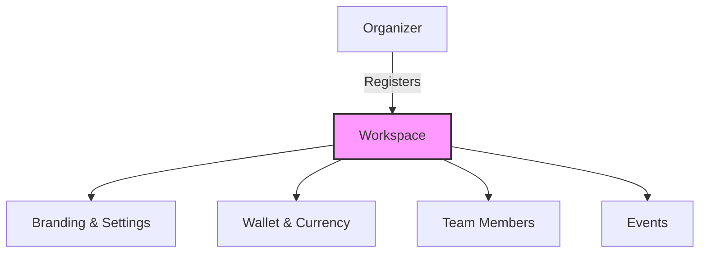
```mermaid
flowchart TD
  User[Organizer] -->|Registers| WS[Workspace]
  WS --> Brand[Branding & Settings]
  WS --> Wallet[Wallet & Currency]
  WS --> Teams[Team Members]
  WS --> Events[Events]

  style WS fill:#f9f,stroke:#333,stroke-width:2px
```

### Currency & Localization

- **Base Currency:** Each Workspace requires an organizer to select a base currency (e.g., `USD`, `RWF`, `EUR`) during setup.
- **Global `formatCurrency` Utility:** All features—including ticket sales, venue entry fees, movie tickets, and bus bookings—derive their pricing format dynamically using the workspace's assigned currency code.
- **Implementation:** The `src/lib/currency.ts` module uses `Intl.NumberFormat` to handle standard localization and precise narrow symbol rendering universally across the platform.

---

## 2. Event Creation & Management

**Logic:**

- Events are created within a Workspace.
- An event contains core metadata (Title, Description, Dates, Venue references).
- Once an event is created, it unlocks the suite of event-specific sub-features (Staffing, Sections, RSVPs, Ticket Design, Badge Design).
- **Database Table:** `events`

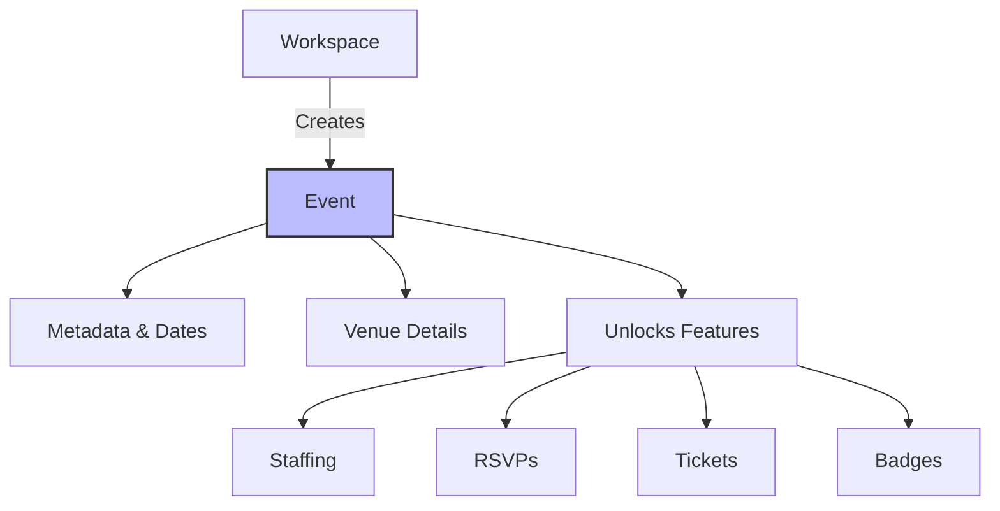
```mermaid
flowchart TD
  WS[Workspace] -->|Creates| Event[Event]
  Event --> Meta[Metadata & Dates]
  Event --> Venue[Venue Details]
  Event --> Unlocks[Unlocks Features]
  Unlocks --> Staffing
  Unlocks --> RSVPs
  Unlocks --> Tickets
  Unlocks --> Badges

  style Event fill:#bbf,stroke:#333,stroke-width:2px
```

---

## 3. Form Creation (RSVPs / Questionnaires)

**Logic:**

- Custom forms can be generated to collect data from attendees or potential staff.
- **Dynamic Fields:** Form configurations are stored as a JSONB array, allowing organizers to dynamically drag-and-drop text inputs, checkboxes, and image upload fields.
- **Data Collection:** When users submit a form, their answers are stored in `rsvp_answers` as a structured JSON object.
- **Staff Onboarding:** You can easily map RSVP form answers (like Profile Picture, First Name, Last Name) directly into the Staff Directory via Bulk Import.

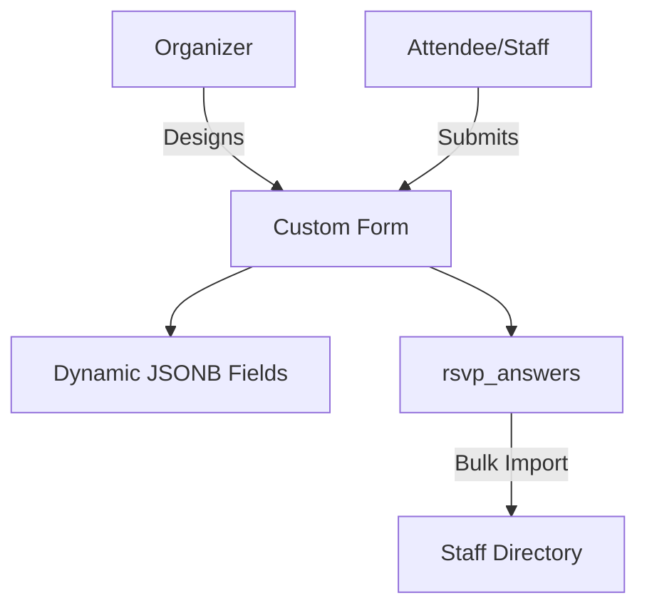
```mermaid
flowchart TD
  Org[Organizer] -->|Designs| Form[Custom Form]
  Form --> Fields[Dynamic JSONB Fields]
  User[Attendee/Staff] -->|Submits| Form
  Form --> Answers[rsvp_answers]
  Answers -->|Bulk Import| StaffDir[Staff Directory]
```

---

## 4. Punch Card Sections (Event Sections)

**Logic:**

- **Sections** represent physical zones or checkpoints within an event (e.g., "Main Gate", "VIP Lounge", "Backstage").
- Organizers define these sections in the dashboard.
- These sections serve as the foundation for **Access Control**. When configuring a staff member's or attendee's credential, you assign them specific `allowed_sections` (stored as an array of UUIDs).
- **Database Table:** `event_sections`

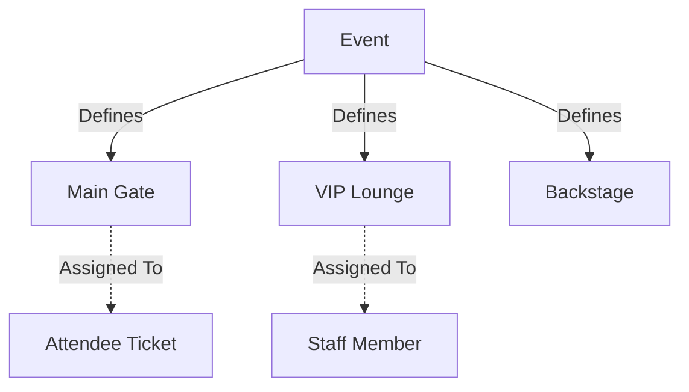
```mermaid
flowchart TD
  Event[Event] -->|Defines| SecA[Main Gate]
  Event -->|Defines| SecB[VIP Lounge]
  Event -->|Defines| SecC[Backstage]
  SecB -.->|Assigned To| Staff[Staff Member]
  SecA -.->|Assigned To| Tkt[Attendee Ticket]
```

---

## 5. Staff Management (Import & Add)

**Logic:**

- Staff members are tied specifically to an `event_id`.
- **Adding Staff:** You can add staff manually one-by-one via the `AddStaffModal` or Bulk Import them from external Vendor forms.
- **Access Control:** Every staff member is assigned an `allowed_sections` JSONB array.
  - If it contains `["*"]`, the staff member has **ALL ACCESS**.
  - If it contains specific IDs (e.g., `["uuid-1", "uuid-2"]`), they are restricted to those zones.
  - If it is empty `[]`, they have **NO ACCESS** to gated zones.
- **Unique Credentials:** Upon creation, a secure, unique `badge_qr_string` (e.g., `STAFF-XYZ123`) is generated for that staff member.
- **Database Table:** `event_staff`

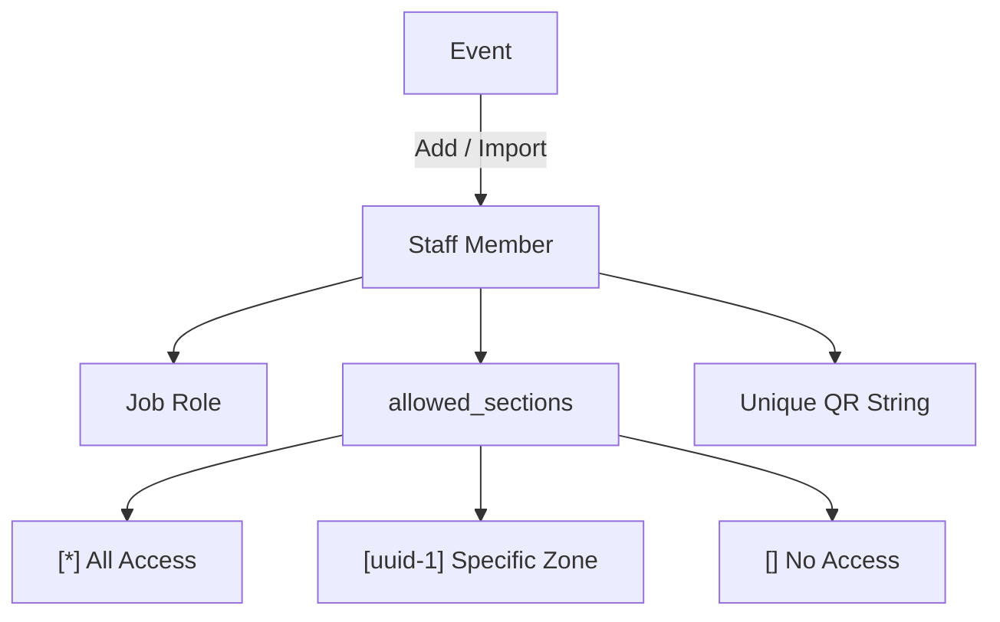
```mermaid
flowchart TD
  Event -->|Add / Import| Staff[Staff Member]
  Staff --> Role[Job Role]
  Staff --> Access[allowed_sections]
  Access --> AllAccess["[*] All Access"]
  Access --> Partial["[uuid-1] Specific Zone"]
  Access --> None["[] No Access"]
  Staff --> QR[Unique QR String]
```

---

## 6. Digital Badge Creation (Badge Designer)

**Logic:**

- The Badge Designer allows organizers to visually customize digital IDs for their staff.
- **Config:** The visual configuration (theme, font, gradient, sponsor logos, QR code placement) is saved in the `badge_projects` table under a specific `event_id`.
- **Dynamic Rendering:** When rendering a badge (via the `BadgePreview` component), the system merges the visual configuration from `badge_projects` with the personal data from `event_staff` (Name, Role, Initials, Profile Image, and QR Code).
- **Security:** The dynamic rendering means that if a staff member's role or access changes, their live digital badge reflects it instantly without needing to reprint anything.

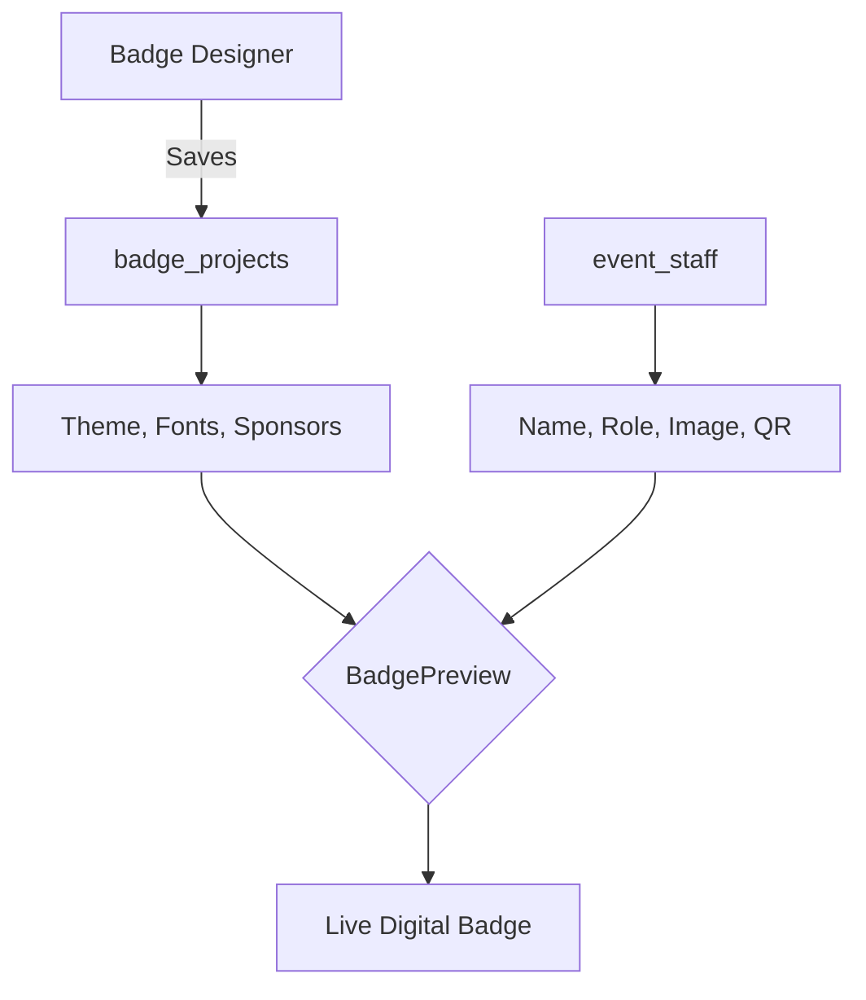
```mermaid
flowchart TD
  Designer[Badge Designer] -->|Saves| Proj[badge_projects]
  Proj --> Config[Theme, Fonts, Sponsors]
  StaffDB[event_staff] --> Data[Name, Role, Image, QR]
  Config --> Merge{BadgePreview}
  Data --> Merge
  Merge --> Rendered[Live Digital Badge]
```

---

## 7. Ticket Creation & Design

**Logic:**

- Similar to Badge Creation, organizers use the `Ticket Designer` to visually construct the digital tickets that attendees receive upon purchase.
- **Config:** The design payload is stored in `ticket_projects` (tied to an event).
- **Issuance:** When an attendee purchases a ticket or RSVPs, a unique record is created in the `tickets` table with a secure `qr_string` (e.g., `TKT-987ABC`).
- **Dynamic Merging:** The public ticket route merges the organizer's Ticket Design with the buyer's data (Name, Ticket Type, QR Code) to present a beautiful Apple Wallet-style digital pass.
- **Scanning:** Tickets are scanned at the "Main Gate" sections to validate entry and prevent duplicate check-ins.

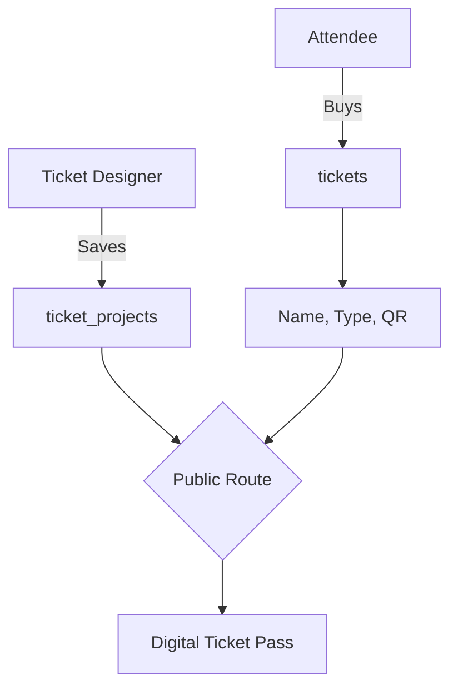
```mermaid
flowchart TD
  Designer[Ticket Designer] -->|Saves| TktProj[ticket_projects]
  Purchaser[Attendee] -->|Buys| TicketDB[tickets]
  TicketDB --> TktData[Name, Type, QR]
  TktProj --> Merge{Public Route}
  TktData --> Merge
  Merge --> AppleWallet[Digital Ticket Pass]
```

---

## 8. Badge & Ticket Scanning (Access Control)

### A. Agatike Scanner App (For Security Personnel)

- **Logic:** The security guard selects their current location (e.g., "VIP Lounge") in the `ScannerMobile` view.
- When they scan a credential QR code, the system fetches the record via the string.
- **Validation:**
  1. Checks if status `=== "active"`.
  2. Checks if `allowed_sections` includes `"*"` (All Access).
  3. If not all access, checks if `allowed_sections` includes the ID of the guard's current location.
- Returns a distinct Green "Access Granted" or Red "Access Denied" full-screen alert.

### B. Public Verification Route (For Standard Cameras)

- **Logic:** The QR code printed on the digital badge actually embeds a full URL: `https://app.agatike.com/b/[badge_qr_string]`.
- If an attendee or guard scans it with a normal iOS/Android camera, it opens the `/b/$qrString` public route.
- **Security Features:**
  - This route fetches the user's data and their event's custom Badge Design and renders an authentic digital credential on the phone screen.
  - To prevent screenshotting or credential sharing, a **60-Second Auto-Expiration Timer** runs. Once it hits zero, the badge disappears and the user must re-scan the QR code.
  - Hides the dashboard mobile navigation bar completely to prevent unauthorized navigation.

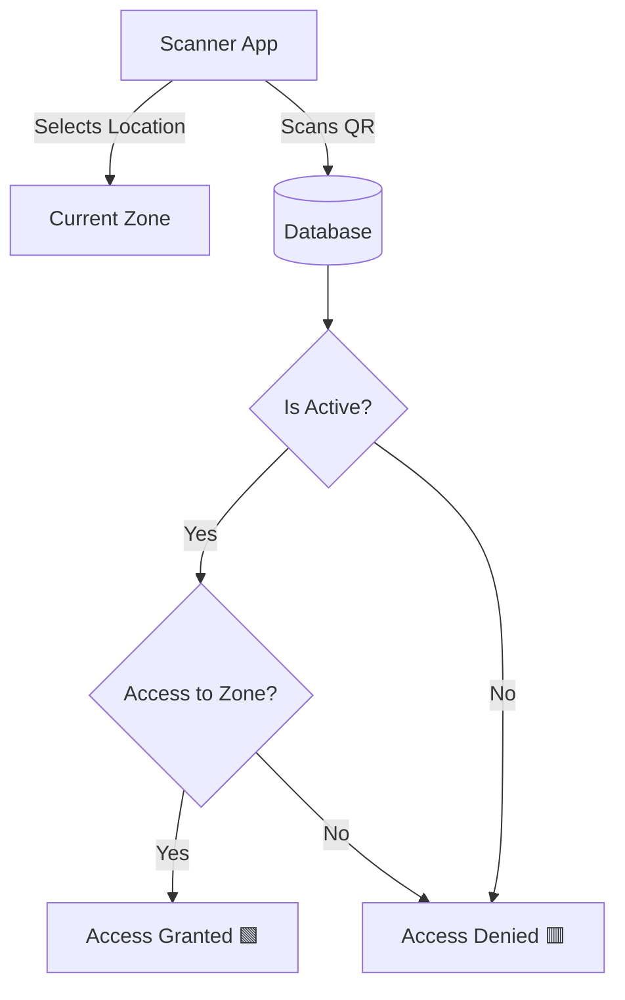
```mermaid
flowchart TD
  Scanner[Scanner App] -->|Selects Location| Loc[Current Zone]
  Scanner -->|Scans QR| DB[(Database)]
  DB --> CheckActive{Is Active?}
  CheckActive -->|Yes| CheckZone{Access to Zone?}
  CheckActive -->|No| Denied[Access Denied 🟥]
  CheckZone -->|Yes| Granted[Access Granted 🟩]
  CheckZone -->|No| Denied
```

---

## 9. Products, Add-ons, Punch Cards & Vouchers

**Logic:**

- Organizers can create digital and physical merchandise to sell or distribute to attendees.
- **Punch Cards:** A pre-paid digital asset that holds a specific `punch_count` (e.g., 5 Free Drinks). When scanned, the Agatike Scanner App decrements the punch count by 1 (simulating a hole punch) until the card reaches 0.
- **Vouchers:** A digital gift card or wallet loaded with a specific monetary `value_amount` (e.g., $60 Food & Drink Voucher).
- **Loyalty Cards:** An earned asset where users accumulate stamps (up to `punch_count`) to redeem a `reward_description` (e.g., 10 stamps = 1 Free Drink).
- **Physical Merch:** Standard trackable inventory (e.g., T-Shirts, Posters).
- **Database Table:** `products` (using `type` = `punch_card`, `voucher`, `loyalty_card`, or `physical`)

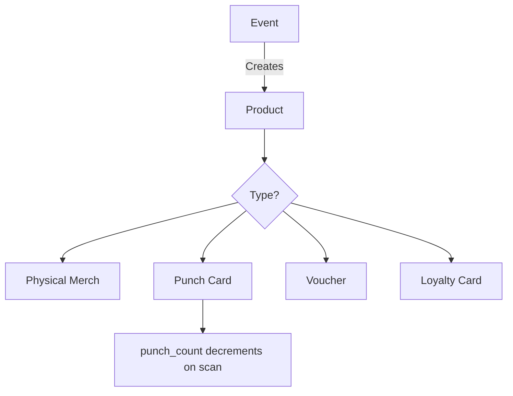
```mermaid
flowchart TD
  Event -->|Creates| Product[Product]
  Product --> Type{Type?}
  Type --> Physical[Physical Merch]
  Type --> Punch[Punch Card]
  Type --> Voucher[Voucher]
  Type --> Loyalty[Loyalty Card]
  Punch --> Uses[punch_count decrements on scan]
```

---

## 10. Vendor Creation

**Logic:**

- Vendors operate similarly to staff or sub-organizers but typically manage their own products, stalls, or add-ons within an event context.
- Allows event organizers to monetize physical space by onboarding external vendors into the event ecosystem and tracking their specific sales.

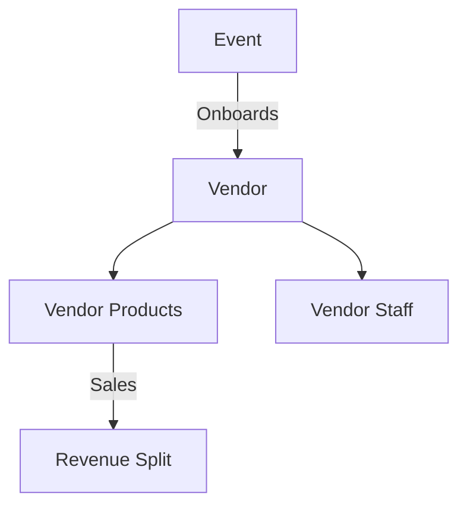
```mermaid
flowchart TD
  Event -->|Onboards| Vendor[Vendor]
  Vendor --> Products[Vendor Products]
  Vendor --> Staff[Vendor Staff]
  Products -->|Sales| Revenue[Revenue Split]
```

---

## 11. Wallets & Withdrawals (Financials)

**Logic:**

- **Wallets:** Every Workspace has a dedicated Wallet (`wallets` table) that tracks their aggregate balance across all events.
- **Transaction Ledger:** The `wallet_transactions` table acts as a double-entry ledger tracking money moving in and out of the workspace.
  - **Credits:** Incoming funds from ticket sales or merchandise.
  - **Debits:** Outgoing funds when an organizer requests a withdrawal.
- **Withdrawal Requests:** Organizers request payouts (via MTN MoMo, Bank Transfer, etc.) from the Withdrawals Dashboard. This inserts a `pending` Debit transaction.
- **Reconciliation:** The admin or automated system processes the payout and updates the `status` to `completed`, referencing the external payout provider's ID.

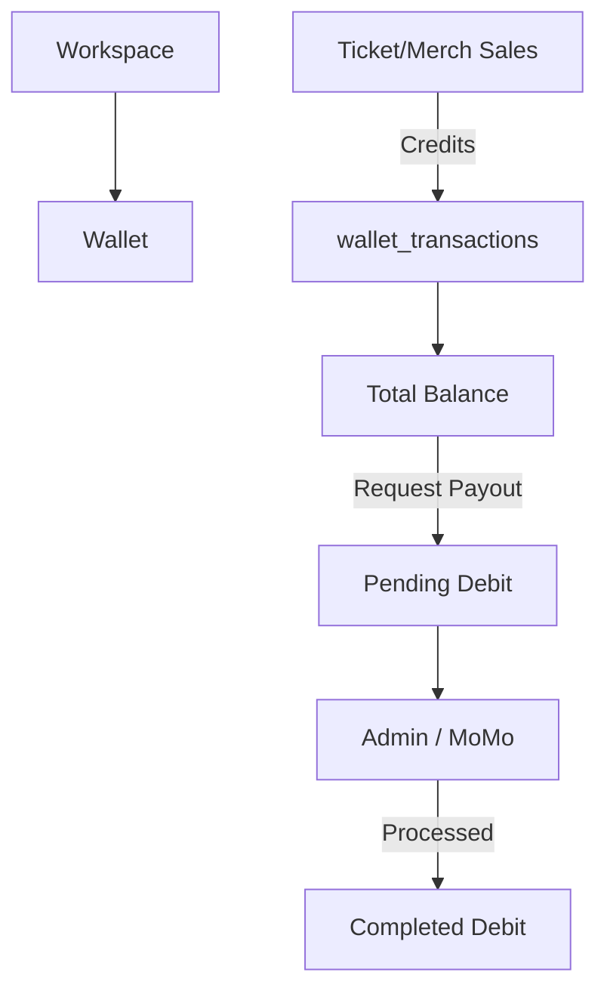
```mermaid
flowchart TD
  WS[Workspace] --> Wallet[Wallet]
  Sales[Ticket/Merch Sales] -->|Credits| Ledger[wallet_transactions]
  Ledger --> Balance[Total Balance]
  Balance -->|Request Payout| Withdraw[Pending Debit]
  Withdraw --> Admin[Admin / MoMo]
  Admin -->|Processed| Completed[Completed Debit]
```

---

## 12. Currency & Payment Provider Logic (MTN MoMo)

**Logic:**

- **Wallet Scoped Currency:** When a Workspace Wallet is created, it is assigned a specific 3-letter ISO `currency` code (e.g., `RWF`, `USD`, `EUR`). This acts as the default currency for the entire workspace.
- **Strict Currency Formatting:** The frontend strictly uses the `Intl.NumberFormat` API dynamically localized to the Wallet's assigned currency. String literals like "dollars" will crash the formatter, so the system enforces strict sanitization.
- **Global Scaling:** By relying on `Intl.NumberFormat("en-US", { style: "currency", currency: wallet.currency })`, an American organizer will see **$50.00** while a Rwandan organizer seamlessly sees **RWF 50,000** without needing hardcoded symbols.
- **Provider Metadata:** To accommodate telecom integrations like **MTN MoMo**, the `wallet_transactions` table strictly tracks:
  - `amount`: The gross amount.
  - `net_amount`: The amount after platform/gateway fees.
  - `fee`: The exact fee deducted.
  - `provider_reference`: The external transaction ID from MTN MoMo.
  - `provider_status`: The raw status returned by MTN MoMo (e.g., "SUCCESSFUL", "FAILED").
  - `payout_method` & `payout_account`: How and where the money was sent (e.g., "momo" / "+250788123456").

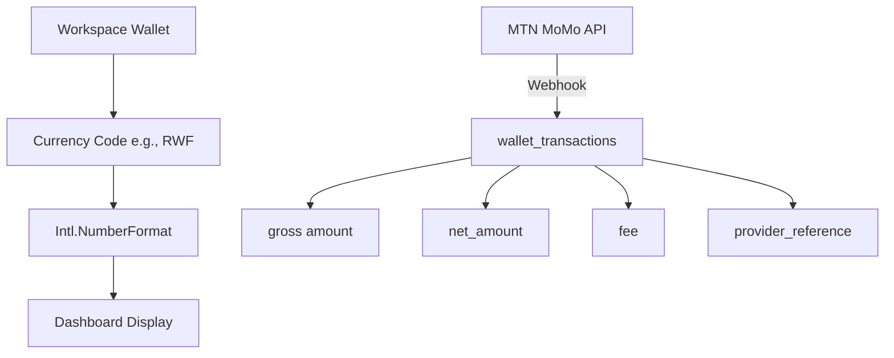
```mermaid
flowchart TD
  Wallet[Workspace Wallet] --> Curr[Currency Code e.g., RWF]
  Curr --> Formatter[Intl.NumberFormat]
  Formatter --> UI[Dashboard Display]
  MoMo[MTN MoMo API] -->|Webhook| Ledger[wallet_transactions]
  Ledger --> Gross[gross amount]
  Ledger --> Net[net_amount]
  Ledger --> Fee[fee]
  Ledger --> Ref[provider_reference]
```

---

## Routing Architecture Reminder

This app uses **TanStack Start** file-based routing.

| File Pattern          | URL                                        |
| --------------------- | ------------------------------------------ |
| `index.tsx`           | `/`                                        |
| `dashboard.$slug.tsx` | `/dashboard/:slug`                         |
| `b.$qrString.tsx`     | `/b/:qrString` (Public Verification Route) |
| `__root.tsx`          | The global app shell layout                |

_Note: The old README located at `src/routes/README.md` has been moved and merged into this central root `README.md`._

---

## 13. Budget & Settlement (`/planning`)

**Route:** `/dashboard/$workspaceSlug/events/$eventId/planning`  
**File:** `src/routes/dashboard.$workspaceSlug.events.$eventId.planning.tsx`

The Budget & Settlement page is the **financial command centre** for an event. It is structured as a 4-tab interface, each with a dedicated sub-component.

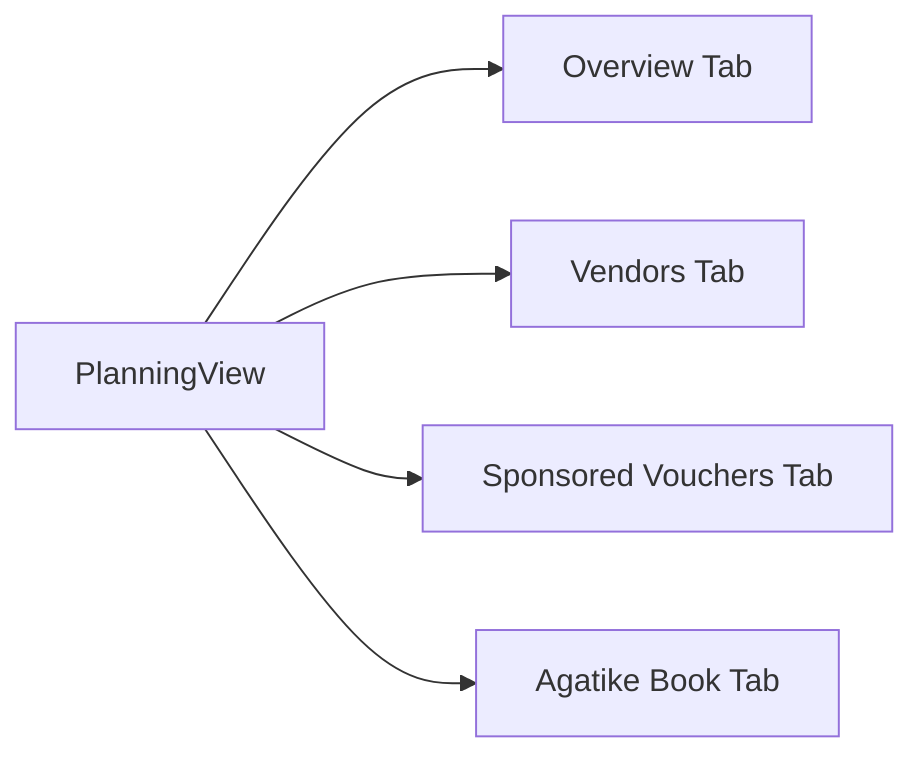
```mermaid
graph LR
    PlanningView --> OV[Overview Tab]
    PlanningView --> VE[Vendors Tab]
    PlanningView --> VO[Sponsored Vouchers Tab]
    PlanningView --> BK[Agatike Book Tab]
```

---

### 13.1 Vendors Tab

Vendors are physical stalls or service providers at the event who can accept sponsored vouchers as payment.

**Key Logic:**

- On creation, each vendor is auto-assigned a system ID: `VND-` + 6 random alphanumeric characters (e.g. `VND-AB3K7F`). This ID is used by the Agatike Scanner app to identify the vendor terminal.
- Clicking any vendor card opens a **Ledger Modal** showing every voucher transaction they have processed, with date, description, voucher QR code, and amount.
- The ledger can be **exported to CSV** via a browser Blob download, with proper quote-escaping on text fields.

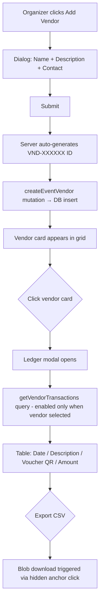
```mermaid
flowchart TD
    A[Organizer clicks Add Vendor] --> B[Dialog: Name + Description + Contact]
    B --> C[Submit]
    C --> D[Server auto-generates VND-XXXXXX ID]
    D --> E[createEventVendor mutation → DB insert]
    E --> F[Vendor card appears in grid]
    F --> G{Click vendor card}
    G --> H[Ledger modal opens]
    H --> I[getVendorTransactions query - enabled only when vendor selected]
    I --> J[Table: Date / Description / Voucher QR / Amount]
    J --> K{Export CSV}
    K --> L[Blob download triggered via hidden anchor click]
```

**Database table:** `event_vendors`

---

### 13.2 Sponsored Vouchers Tab

Sponsored Vouchers are digital credit instruments issued to attendees. The system supports two distinct campaign types:

| Type                 | Behaviour                                                                                             |
| -------------------- | ----------------------------------------------------------------------------------------------------- |
| **Standalone Batch** | N voucher QR codes are pre-generated immediately with a fixed monetary value                          |
| **Ticket-Attached**  | No vouchers pre-generated; one voucher is created automatically when a qualifying ticket is purchased |

**Voucher Value Types (Ticket-Attached only):**

- `match_ticket_price` — Voucher value = the cost of the ticket that triggered it
- `fixed` — Voucher value = a custom RWF amount defined by the organizer

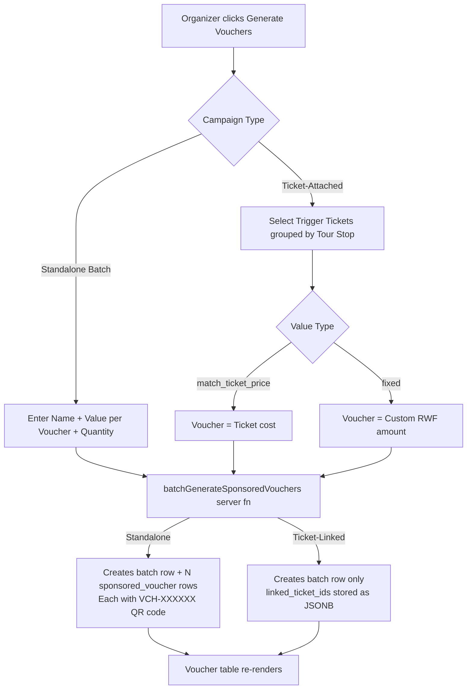
```mermaid
flowchart TD
    A[Organizer clicks Generate Vouchers] --> B{Campaign Type}
    B -->|Standalone Batch| C[Enter Name + Value per Voucher + Quantity]
    B -->|Ticket-Attached| D[Select Trigger Tickets grouped by Tour Stop]
    D --> E{Value Type}
    E -->|match_ticket_price| F[Voucher = Ticket cost]
    E -->|fixed| G[Voucher = Custom RWF amount]
    C & F & G --> H[batchGenerateSponsoredVouchers server fn]
    H -->|Standalone| I[Creates batch row + N sponsored_voucher rows\nEach with VCH-XXXXXX QR code]
    H -->|Ticket-Linked| J[Creates batch row only\nlinked_ticket_ids stored as JSONB]
    I & J --> K[Voucher table re-renders]
```

**Pagination:** The voucher table supports 10/20/50/100 rows per page using client-side slicing (`vouchers.slice((currentPage-1)*pageSize, currentPage*pageSize)`).

**Analytics (computed client-side):**

- `totalProvisioned` = sum of `current_balance + voucher_transactions.sum` per voucher
- `totalSpent` = sum of all transaction amounts
- `totalRemaining` = sum of current balances

**Database tables:** `sponsored_voucher_batches`, `sponsored_vouchers`, `voucher_transactions`

---

### 13.3 Agatike Book Tab (Custom Book Builder)

The Agatike Book is a fully flexible, custom spreadsheet/database builder — similar in concept to Notion or Airtable — where organizers can track anything about their event in a structured tabular format.

#### Two-Step Builder Flow

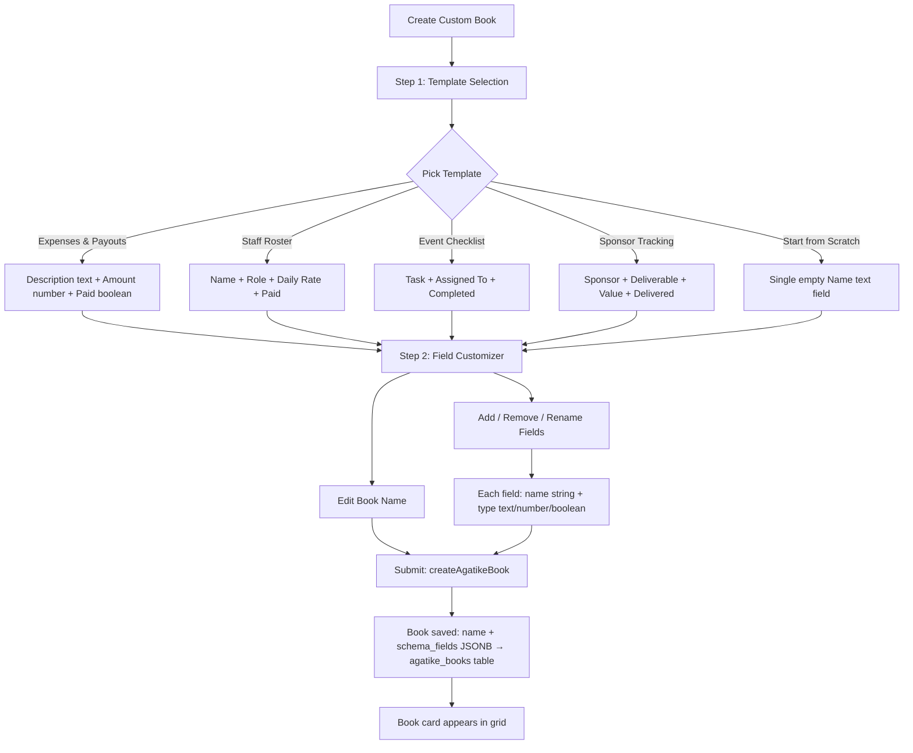
```mermaid
flowchart TD
    A[Create Custom Book] --> B[Step 1: Template Selection]
    B --> C{Pick Template}
    C -->|Expenses & Payouts| D[Description text + Amount number + Paid boolean]
    C -->|Staff Roster| E[Name + Role + Daily Rate + Paid]
    C -->|Event Checklist| F[Task + Assigned To + Completed]
    C -->|Sponsor Tracking| G[Sponsor + Deliverable + Value + Delivered]
    C -->|Start from Scratch| H[Single empty Name text field]
    D & E & F & G & H --> I[Step 2: Field Customizer]
    I --> J[Edit Book Name]
    I --> K[Add / Remove / Rename Fields]
    K --> L[Each field: name string + type text/number/boolean]
    J & L --> M[Submit: createAgatikeBook]
    M --> N[Book saved: name + schema_fields JSONB → agatike_books table]
    N --> O[Book card appears in grid]
```

#### Record Management Flow

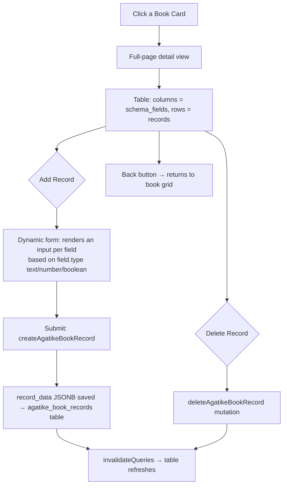
```mermaid
flowchart TD
    A[Click a Book Card] --> B[Full-page detail view]
    B --> C[Table: columns = schema_fields, rows = records]
    C --> D{Add Record}
    D --> E[Dynamic form: renders an input per field\nbased on field.type text/number/boolean]
    E --> F[Submit: createAgatikeBookRecord]
    F --> G[record_data JSONB saved → agatike_book_records table]
    G --> H[invalidateQueries → table refreshes]
    C --> I{Delete Record}
    I --> J[deleteAgatikeBookRecord mutation]
    J --> H
    C --> K[Back button → returns to book grid]
```

#### Field Types

| Type      | UI Control              | Stored As      |
| --------- | ----------------------- | -------------- |
| `text`    | `<Input type="text">`   | string         |
| `number`  | `<Input type="number">` | numeric string |
| `boolean` | `<Checkbox>`            | `true / false` |

#### Data Schema

`agatike_books.schema_fields` (JSONB):

```json
[
  { "name": "Description", "type": "text" },
  { "name": "Amount", "type": "number" },
  { "name": "Paid", "type": "boolean" }
]
```

`agatike_book_records.record_data` (JSONB):

```json
{
  "Description": "Sound Equipment Hire",
  "Amount": "150000",
  "Paid": true
}
```

**Data sync pattern:** A `useEffect` watches both `books` (refetched after mutations) and `activeBook`. When data updates, it finds the updated book object by ID and re-syncs `activeBook` so the table always displays fresh records without resetting the user's navigation state.

**Database tables:** `agatike_books`, `agatike_book_records`

---

### 13.4 Overview Tab (Financial Dashboard)

The Overview Tab aggregates live data from all three other tabs — Tickets, Vendors, Vouchers, and Agatike Books — into a single financial snapshot.

> ⚠️ **Critical architecture note:** The Overview uses `getSponsoredVoucherBatches` (returns raw batch objects) — **not** `getSponsoredVouchers` (which returns a per-voucher flat list). Using the flat list caused "Unnamed Batch / Quantity 0" bugs because each row had no `.name` or `.vouchers` array.

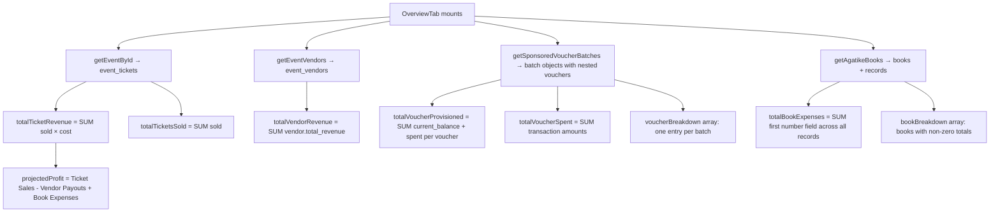
```mermaid
flowchart TD
    OT[OverviewTab mounts] --> Q1[getEventById → event_tickets]
    OT --> Q2[getEventVendors → event_vendors]
    OT --> Q3[getSponsoredVoucherBatches → batch objects with nested vouchers]
    OT --> Q4[getAgatikeBooks → books + records]

    Q1 --> TR[totalTicketRevenue = SUM sold × cost]
    Q1 --> TS[totalTicketsSold = SUM sold]
    Q2 --> VR[totalVendorRevenue = SUM vendor.total_revenue]
    Q3 --> VP[totalVoucherProvisioned = SUM current_balance + spent per voucher]
    Q3 --> VS[totalVoucherSpent = SUM transaction amounts]
    Q3 --> VB[voucherBreakdown array: one entry per batch]
    Q4 --> BE[totalBookExpenses = SUM first number field across all records]
    Q4 --> BB[bookBreakdown array: books with non-zero totals]

    TR --> PP[projectedProfit = Ticket Sales - Vendor Payouts + Book Expenses]
```

#### KPI Cards

| Card                 | Formula                                           |
| -------------------- | ------------------------------------------------- |
| Ticket Sales         | `SUM(sold × cost)` across all ticket types        |
| Vouchers Provisioned | `SUM(current_balance + spent)` per voucher        |
| Vendor Payouts       | `SUM(vendor.total_revenue)`                       |
| Book Expenses        | `SUM(first number field)` in each Agatike Book    |
| Est. Net Profit      | `Ticket Sales − (Vendor Payouts + Book Expenses)` |

#### Voucher Portfolio Table

Shows the first **6** voucher campaigns. If there are more than 6, a "View All N Campaigns" button appears and opens a full-screen scrollable Dialog with the complete list.

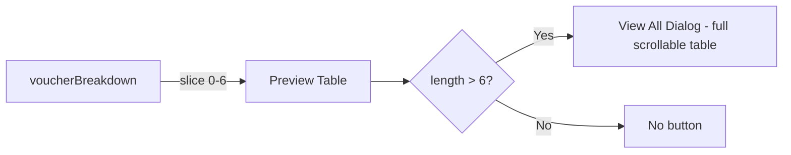
```mermaid
flowchart LR
    voucherBreakdown -->|slice 0-6| Table[Preview Table]
    Table --> Btn{length > 6?}
    Btn -->|Yes| Modal[View All Dialog - full scrollable table]
    Btn -->|No| Nothing[No button]
```

---

## 14. Attendees (`/attendees`)

**Route:** `/dashboard/$workspaceSlug/events/$eventId/attendees`  
**File:** `src/routes/dashboard.$workspaceSlug.events.$eventId.attendees.tsx`

Manages all attendee records for an event — viewing, searching, importing from RSVP forms, sending bulk emails, and exporting to CSV.

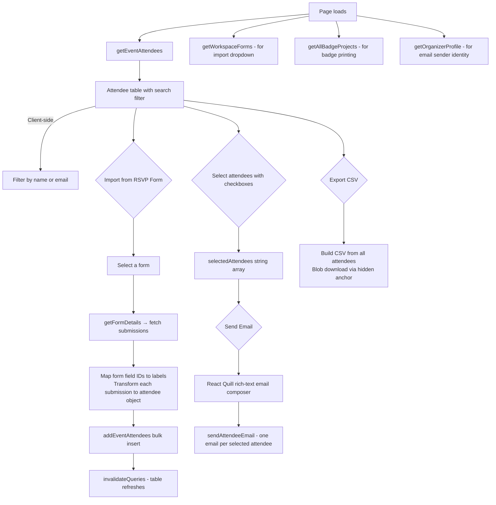
```mermaid
flowchart TD
    A[Page loads] --> B[getEventAttendees]
    A --> C[getWorkspaceForms - for import dropdown]
    A --> D[getAllBadgeProjects - for badge printing]
    A --> E[getOrganizerProfile - for email sender identity]

    B --> F[Attendee table with search filter]
    F -->|Client-side| G[Filter by name or email]

    F --> H{Import from RSVP Form}
    H --> I[Select a form]
    I --> J[getFormDetails → fetch submissions]
    J --> K[Map form field IDs to labels\nTransform each submission to attendee object]
    K --> L[addEventAttendees bulk insert]
    L --> M[invalidateQueries - table refreshes]

    F --> N{Select attendees with checkboxes}
    N --> O[selectedAttendees string array]
    O --> P{Send Email}
    P --> Q[React Quill rich-text email composer]
    Q --> R[sendAttendeeEmail - one email per selected attendee]

    F --> S{Export CSV}
    S --> T[Build CSV from all attendees\nBlob download via hidden anchor]
```

### RSVP Form Import

When an organizer imports from a custom form:

1. `getFormDetails` fetches the full form schema + all RSVP submissions
2. `form_fields` are reduced into a `{ field_id: label }` map
3. Each RSVP answer object is transformed using this map to produce a normalized attendee object
4. All attendees are bulk-inserted via `addEventAttendees`

### Email Composer

- Uses **React Quill** for a WYSIWYG rich-text editor
- Sends HTML email body to all `selectedAttendees`
- Organizer's display name and sender email are sourced from `getOrganizerProfile`

**Database table:** `event_attendees`

---

## 15. Database Tables Reference

| Table                       | Purpose                                                       |
| --------------------------- | ------------------------------------------------------------- |
| `events`                    | Core event data: title, dates, ticket types, tour stops       |
| `event_vendors`             | Vendors registered to an event; holds unique `VND-XXXXXX` IDs |
| `sponsored_voucher_batches` | Voucher campaigns: name, type, value, linked ticket IDs       |
| `sponsored_vouchers`        | Individual voucher QR codes and their current balances        |
| `voucher_transactions`      | Each time a vendor scans and charges a voucher                |
| `agatike_books`             | Custom book definitions: name + `schema_fields` JSONB         |
| `agatike_book_records`      | Individual data rows: `record_data` JSONB keyed by field name |
| `event_attendees`           | Attendee roster per event                                     |
| `event_staff`               | Staff members with access control sections                    |
| `badge_projects`            | Visual badge design configurations                            |
| `ticket_projects`           | Visual ticket design configurations                           |
| `wallets`                   | Workspace financial balance                                   |
| `wallet_transactions`       | Ledger: credits (sales) and debits (payouts)                  |

---

## 16. API Functions Reference

### Vendors (`src/api/vendors.ts`)

| Function                | Purpose                                           |
| ----------------------- | ------------------------------------------------- |
| `getEventVendors`       | Fetch all vendors for an event                    |
| `createEventVendor`     | Create vendor with auto-generated `VND-XXXXXX` ID |
| `deleteEventVendor`     | Delete vendor by ID                               |
| `getVendorTransactions` | All voucher transactions for a specific vendor    |

### Vouchers (`src/api/vouchers.ts`)

| Function                         | Shape Returned                                                    | Used In                  |
| -------------------------------- | ----------------------------------------------------------------- | ------------------------ |
| `getSponsoredVouchers`           | **Flat list** — one item per voucher, batch metadata attached     | Vouchers Tab table       |
| `getSponsoredVoucherBatches`     | **Batch objects** — one item per campaign, vouchers nested inside | Overview Tab analytics   |
| `batchGenerateSponsoredVouchers` | Creates batch + optional pre-generated vouchers                   | Vouchers Tab create form |
| `chargeVoucher`                  | Records a vendor scan transaction                                 | Scanner App              |

### Agatike Books (`src/api/book.ts`)

| Function                  | Purpose                                               |
| ------------------------- | ----------------------------------------------------- |
| `getAgatikeBooks`         | Fetch all books + nested records for an event         |
| `createAgatikeBook`       | Create a new book with `name` + `schema_fields` JSONB |
| `createAgatikeBookRecord` | Add a row (`record_data` JSONB) to a book             |
| `deleteAgatikeBook`       | Delete a book and all its records                     |
| `deleteAgatikeBookRecord` | Delete a single record from a book                    |

### Attendees (`src/api/attendees.ts`)

| Function            | Purpose                                         |
| ------------------- | ----------------------------------------------- |
| `getEventAttendees` | Fetch all attendees for an event                |
| `addEventAttendees` | Bulk insert attendees (used during RSVP import) |

### Events (`src/api/events.ts`)

| Function       | Purpose                                               |
| -------------- | ----------------------------------------------------- |
| `getEventById` | Full event: metadata + `event_tickets` + `tour_stops` |

### Email (`src/api/email.ts`)

| Function            | Purpose                                       |
| ------------------- | --------------------------------------------- |
| `sendAttendeeEmail` | Send rich HTML email to one or more attendees |

---

## Updated Routing Architecture

| Route File                                               | URL                | Page                |
| -------------------------------------------------------- | ------------------ | ------------------- |
| `index.tsx`                                              | `/`                | Landing / Home      |
| `dashboard.$workspaceSlug.tsx`                           | `/dashboard/:slug` | Dashboard shell     |
| `dashboard.$workspaceSlug.events.$eventId.planning.tsx`  | `.../planning`     | Budget & Settlement |
| `dashboard.$workspaceSlug.events.$eventId.attendees.tsx` | `.../attendees`    | Attendees           |
| `dashboard.$workspaceSlug.events.$eventId.lineup.tsx`    | `.../lineup`       | Event Lineup        |
| `dashboard.$workspaceSlug.page-builder.tsx`              | `.../page-builder` | Page Builder        |
| `b.$qrString.tsx`                                        | `/b/:qrString`     | Public Verification |
| `__root.tsx`                                             | —                  | Global App Shell    |

---

## 17. Page Builder (`/page-builder`)

**Route:** `/dashboard/$workspaceSlug/page-builder`  
**File:** `src/routes/dashboard.$workspaceSlug.page-builder.tsx`

The Page Builder is a no-code visual website editor that allows organizers to build branded public-facing landing pages — event pages, registration hubs, sponsor showcases — and publish them live at `/p/:slug`.

### Architecture: 3-Panel Layout

```mermaid
graph LR
    PageBuilder --> LeftSidebar[Left Sidebar\nPage list + create]
    PageBuilder --> RightMain[Main Area - 2 columns]
    RightMain --> SettingsPanel[Left Col: Toolbox + Page Settings]
    RightMain --> Canvas[Right Col: Live Canvas preview]
```

### State Model

| State          | Type             | Purpose                                                           |
| -------------- | ---------------- | ----------------------------------------------------------------- |
| `activePageId` | `string \| null` | Which saved page is selected; null = nothing selected             |
| `editorState`  | `object`         | Full local working copy of the page being edited                  |
| `isNewPage`    | `boolean`        | Whether the current session is building a brand-new, unsaved page |

The `editorState` object shape:

```ts
{
  id: string | null,       // null until first save
  slug: string,            // URL-safe path e.g. "my-event-2026"
  title: string,           // Hero headline
  description: string,     // Hero subtitle
  themeColor: string,      // Hex color e.g. "#7C3AED"
  headerImageUrl: string,  // Cover/hero background image
  logoUrl: string,         // Organisation logo
  logoPosition: "hero" | "navbar",
  fontFamily: string,      // One of Inter | Outfit | Montserrat | Playfair | Lora
  components: Block[],     // Ordered array of content blocks
}
```

### Page Lifecycle

```mermaid
flowchart TD
    A[Page Builder mounts] --> B[getAllWorkspacePages - list all pages]
    B --> C[Left sidebar shows page list with slug + Published/Draft badge]

    C --> D{User action}
    D -->|Click existing page| E[setActivePageId]
    E --> F[getWorkspacePage - fetch full page data]
    F --> G[useEffect hydrates editorState from pageData\nFilters out page_settings block into top-level fields]
    G --> H[Canvas + settings panel populate]

    D -->|Click + New Page| I[setIsNewPage true\nReset editorState to makeBlankPage]
    I --> H

    H --> J{Publish button}
    J --> K[Validate: slug is required]
    K --> L[saveMutation: upsertWorkspacePage\nMerges page_settings block back into components array]
    L -->|New page| M[Store returned id in editorState\nUpdate activePageId]
    L -->|Existing page| N[invalidateQueries - sidebar refreshes]

    H --> O{Delete button}
    O --> P[AlertDialog confirm]
    P --> Q[deleteMutation: deleteWorkspacePage]
    Q --> R[Reset editor to blank state]
```

### The `page_settings` Block Pattern

When a page is **saved**, a special `{ type: "page_settings" }` block is prepended to the `components` array:

```json
{
  "type": "page_settings",
  "logoPosition": "hero",
  "fontFamily": "Inter"
}
```

When a page is **loaded**, `useEffect` extracts this block, puts its values into top-level `editorState` fields, and **filters it out** of the `components` array so it never appears as a draggable block in the canvas. This keeps `logoPosition` and `fontFamily` cleanly separated from user-facing blocks.

### Preview Mode

```mermaid
flowchart LR
    A[Preview button clicked] --> B[Serialize full editorState + page_settings block]
    B --> C[localStorage.setItem page_preview_data]
    C --> D[window.open /p/slug?preview=true in new tab]
    D --> E[Public page route reads localStorage when preview=true\nDisplays live unsaved state]
```

This allows organizers to preview their page exactly as it will look — **without needing to save first**.

### Image Upload System

All image uploads (header, logo, blocks) route through `uploadFileToStorage`:

- Validates file size before upload (7MB for page media, 5MB for blocks, 2MB for logos)
- Uploads to Firebase Storage at path `pages/{workspace_id}/{timestamp}`
- Returns a permanent URL stored in the component's state
- Uses a loading toast that transitions to success/error on completion

---

### Block System

Every content block on the canvas is rendered by the `ComponentBlock` sub-component. Each block has:

- A type label in the top-left corner
- An optional **Nav Label** input (used by the public page renderer to build an anchor navigation bar)
- Move-up / Move-down controls (shown on hover via `moveComponent`)
- A delete button (shown on hover via `removeComponent`)

#### Available Block Types

| Block Type             | Key             | Config Fields                                                     |
| ---------------------- | --------------- | ----------------------------------------------------------------- |
| **Text Block**         | `text`          | `content` (textarea)                                              |
| **Image Block**        | `image`         | `url` (file upload → Firebase)                                    |
| **Split Layout**       | `split_block`   | `text`, `imageUrl`, `imagePosition` (`left`/`right`)              |
| **Action Button**      | `button`        | `label`, `url` (external link)                                    |
| **Basic Form Link**    | `form_link`     | `content` (form ID), `design` (`card`/`button`)                   |
| **Advanced Form Grid** | `form_grid`     | `columns` (1/2/3), `cardBgColor`, `cardTextColor`, array of cards |
| **Logos Grid**         | `sponsor_logos` | `title`, `logos[]` (array of uploaded image URLs)                 |

#### Block State Management Pattern

```mermaid
flowchart LR
    addComponent --> newComp[Creates new block object with id=Date.now]
    newComp --> setEditorState[Appends to components array]

    updateComponent --> immutableCopy[Spreads existing components array]
    immutableCopy --> overwrite[Overwrites specific key on target index]
    overwrite --> setEditorState

    removeComponent --> spliceOut[Removes index from copy]
    spliceOut --> setEditorState

    moveComponent --> swap[Swaps block at index with index+dir]
    swap --> setEditorState
```

All mutations are pure immutable operations — the full `components` array is always replaced, never mutated in-place.

---

### Form-Page Integration

The Page Builder pulls `getWorkspaceForms` at mount. Any form marked `is_active = true` is available for embedding in pages via two block types:

```mermaid
flowchart TD
    PageBuilder -->|on mount| Forms[(getWorkspaceForms)]
    Forms --> FormLink[form_link block\nEmbed a single form as card or button]
    Forms --> FormGrid[form_grid block\nEmbed multiple forms as a card grid]
    FormLink --> PublicPage[/p/slug - renders inline form embed]
    FormGrid --> PublicPage
    PublicPage -->|user submits| RSVP[(rsvp_answers)]
    RSVP --> AttendeesPage[Import to /attendees]
```

This creates the full end-to-end funnel: **Page Builder → Public Page → Form Submission → Attendee Import**.

**Database tables:** `workspace_pages`

---

## 18. Attendees Page — Full Logic & Forms Integration

**Route:** `/dashboard/$workspaceSlug/events/$eventId/attendees`  
**File:** `src/routes/dashboard.$workspaceSlug.events.$eventId.attendees.tsx`

### Attendee Types

| `type` value | Origin                               | Display     |
| ------------ | ------------------------------------ | ----------- |
| `customer`   | Bought a ticket through the platform | Blue badge  |
| `attendee`   | Imported from an RSVP form           | Green badge |

### Full Page Data Flow

```mermaid
flowchart TD
    A[Page mounts] --> B[getEventAttendees\nAll attendees for this event]
    A --> C[getWorkspaceForms\nAll workspace forms for import dropdown]
    A --> D[getAllBadgeProjects\nAll badge designs for email attachment]
    A --> E[getOrganizerProfile\nOrganizer name/email/phone for email templates]

    B --> F[filteredAttendees = attendees.filter by searchTerm\nMatches names + email + type]
    F --> G[Table renders: avatar + name + email + type badge + ticket + date + actions]
```

### RSVP Form Import — Detailed Mapping Flow

```mermaid
flowchart TD
    A[Organizer opens Import Modal] --> B[Select from workspace forms dropdown]
    B --> C[Click Import Attendees]
    C --> D[getFormDetails: fetch form schema + all rsvp submissions]
    D --> E[Build fieldMap:\nreduce form_fields to id→label lookup]
    E --> F[Loop each rsvp submission]
    F --> G[Loop rsvp_answers array\nMap each answer field_id → label via fieldMap]
    G --> H[Extract known fields with fallback chains:\nnames: answers.Names OR answers.Name OR rsvp.first_name\nemail: answers.Email OR answers.Email Address OR rsvp.email\nphone: answers.Phone OR answers.Phone Number\nticket_type: answers.Ticket Type/Registration Type OR Form Registration]
    H --> I[Generate random 8-char alphanumeric qrcode_number]
    I --> J[Assemble attendee object:\nevent_id, names, email, phone, ticket_type,\nqrcode_number, status=registered, type=attendee,\ncustom_fields=full answers object]
    J --> K[addEventAttendees: bulk insert all objects]
    K --> L[invalidateQueries event-attendees]
    L --> M[Table refreshes with imported attendees]
```

#### Why `custom_fields`?

Every attendee imported from a form stores the **full raw answers** object as `custom_fields` (JSONB). This means any question asked in the form (even custom ones like "Dietary Requirements", "Company Name") is preserved and viewable in the **Attendee Details Modal** → "Custom Responses" section — even if the field wasn't one of the standard extracted fields.

### Attendee Selection & Bulk Actions

```mermaid
flowchart TD
    Table --> CheckboxHeader[Select All checkbox in header]
    Table --> RowCheckbox[Individual row checkboxes]
    CheckboxHeader -->|checked| SelectAll[setSelectedAttendees filteredAttendees.map id]
    CheckboxHeader -->|unchecked| ClearAll[setSelectedAttendees empty array]
    RowCheckbox -->|checked| AddToArray[append id to selectedAttendees]
    RowCheckbox -->|unchecked| RemoveFromArray[filter out id from selectedAttendees]

    SelectedAttendees -->|length > 0| BulkBar[Bulk action bar slides in with count badge]
    BulkBar --> BulkEmail[Send Bulk Email button → BulkEmailModal]
```

### Attendee Details Modal (`AttendeeDetailsModal`)

Opened per row via the Eye icon button. Displays:

- Core fields: Type, Ticket Type, Status, Quantity
- **Custom Responses**: all key→value pairs from `custom_fields`
- **Badge Design selector**: choose which badge design to link in the email

Actions available:

- **View Badge** — opens `/a/{qrcode_number}?badgeId={selectedBadgeId}` in new tab
- **SMS** — opens SMS composer (plain textarea)
- **Email** — opens rich email composer with React Quill

### Email Template System

Both single-attendee and bulk emails use an identical template with **template variables** that are replaced via regex before sending:

```mermaid
flowchart TD
    Template[HTML Template with placeholders] --> Regex[Regex replace chain]
    Regex --> V1["[First Name] / {{name}} → attendee first name"]
    Regex --> V2["[Registration Details] → auto-generated HTML block\nwith Registration ID + Ticket Number + Badge Link"]
    Regex --> V3["[Contact Email] / {{contact_email}} → organizer email"]
    Regex --> V4["[Phone Number] / {{phone_number}} → organizer phone"]
    Regex --> Final[finalMessage HTML string]
    Final --> sendAttendeeEmail[API call with to/subject/message/badgeLink/org branding]
```

The **Registration Details** block is generated differently based on attendee type:

- `customer` type → shows Registration ID + Ticket Number + clickable "View your digital ticket" badge link
- `rsvp` type → shows "Here is your digital badge" + clickable badge link

### Bulk Email — Sequential Send with Progress

The `BulkEmailModal` sends emails **one-by-one** in a sequential `for` loop (not in parallel) to avoid rate-limiting:

```mermaid
flowchart TD
    Start[handleSendBulk called] --> Init[setIsSending true\nsetProgress 0 of N]
    Init --> Loop[for i=0 to selectedAttendees.length]
    Loop --> FindAttendee[attendees.find by id]
    FindAttendee --> Guard{Has email?}
    Guard -->|No| Skip[increment progress, continue]
    Guard -->|Yes| BuildBadgeLink[Build /a/qrcode?badgeId URL]
    BuildBadgeLink --> BuildRegistrationInfo[Generate registration HTML block]
    BuildRegistrationInfo --> ApplyTemplate[Apply template variable replacements]
    ApplyTemplate --> SendEmail[await sendAttendeeEmail]
    SendEmail --> IncrProgress[increment progress.current]
    IncrProgress --> Loop
    Loop -->|done| SuccessToast[toast.success N emails sent]
    SuccessToast --> CloseModal[setIsOpen false]
    CloseModal --> ClearSelection[onClearSelection callback]
```

A real-time **progress bar** (`progress.current / progress.total × 100%`) fills as each email is sent, giving the organizer live visual feedback. The modal's close button is disabled during sending to prevent accidental interruption.

### Badge Link URL Structure

```
/a/{qrcode_number}?badgeId={selectedBadgeId}
```

- `/a/` routes to the public attendee badge view
- `qrcode_number` = 8-character alphanumeric string generated on import
- `badgeId` query param controls which visual badge design is rendered
- The badge design is selected per-email by the organizer from all `badge_projects` in the workspace

### Forms ↔ Page Builder ↔ Attendees: End-to-End Funnel

```mermaid
flowchart TD
    Organizer -->|Creates form| FormBuilder[Form Builder\nCustom RSVP form with dynamic fields]
    FormBuilder -->|Embeds form on| PageBuilder[Page Builder\nform_link or form_grid block]
    PageBuilder -->|Publishes to| PublicPage[/p/:slug\nPublic landing page]
    PublicPage -->|Visitor submits| RSVPAnswers[(rsvp_answers table)]
    RSVPAnswers -->|Import Registrations| AttendeesPage[Attendees Page]
    AttendeesPage -->|Field mapping transforms| AttendeeRecords[(event_attendees table\nwith custom_fields JSONB)]
    AttendeeRecords -->|Select + email| BulkEmail[Bulk Email with badge link]
    BulkEmail -->|Opens| BadgeRoute[/a/:qrcode_number\nDigital badge/ticket]
```

**Database tables:** `event_attendees`, `rsvp_answers`, `workspace_pages`, `custom_forms`

---

## 19. Venue Designer Canvas

**Route:** `/dashboard/$workspaceSlug/venue-designer`

The Venue Designer is an interactive canvas tool that allows organizers to build and map physical layouts of their venues (Stadiums, Concert Halls, Conference Rooms).

### Logic & Storage Optimization

- **Template Initialization:** Organizers start by choosing a base template (e.g., Football Stadium) or a blank canvas.
- **Location Mapping:** For multi-stop tour events, the organizer can map the venue design to a specific `tour_stop_idx` (Location 1, Location 2) or choose `-1` to apply the same design across all locations.
- **Canvas Rendering:** The designer allows creating dynamic shapes (rectangles, circles, polygons) representing specific sections (e.g., VIP Left, General Admission).
- **Optimized JSON Storage:** To prevent the database from being flooded with hundreds of rows per venue (one for every visual shape or arc), the entire canvas state is serialized into a single `sections_data` JSONB column on the `venue_projects` table.

```mermaid
flowchart TD
    Hub[Venue Designer Hub] -->|Select Template| Modal[Setup Modal]
    Modal -->|Select Event & Location| Create[createVenueProject]
    Create -->|Initialize Canvas| Designer[Venue Canvas Workspace]
    Designer -->|Draw / Edit Sections| State[Local 'sections' array]
    State -->|Click Save| Save[saveVenueProject API]
    Save --> DB[(venue_projects table)]
    DB --> |JSON Serialization| Col[sections_data JSONB column]
    Col --> |Load Project| Designer
```

### Event Sections Integration

While the visual representation lives in JSON, the actual ticketable zones are managed as **Event Sections**. Organizers create discrete "Event Sections" (e.g., VIP Lounge) in the Event Sidebar (`/sections`), which act as the bridge linking Ticket Tiers, Staff Access Credentials, and the physical Venue Map.

**Database tables:** `venue_projects`

---

## 20. Event Experience Dashboard (`/experience`)

**Route:** `/dashboard/$workspaceSlug/events/$eventId/experience`
**File:** `src/routes/dashboard/$workspaceSlug/events/$eventId/experience.tsx`

> The identical component also powers the **Experiences** sub-route at `/dashboard/$workspaceSlug/experiences/$experienceId/experience`. Both share the same file structure and logic; only the `eventId` / `experienceId` URL param differs.

The Experience Dashboard is the **content & engagement hub** for an event or guided experience. Organizers use it to collect and manage attendee feedback, publish ephemeral stories, and create permanent posts — all visible to followers in their feed.

### Page Structure

```mermaid
graph LR
    ExperienceDashboard --> Header[Page Header + Share Feedback Link]
    ExperienceDashboard --> Tabs[3-Tab Interface]
    Tabs --> FB[Reviews Tab]
    Tabs --> ST[Stories Tab]
    Tabs --> PO[Posts Tab]
```

The page header contains a **"Share Feedback Link"** button that copies a public review URL (`/f/{eventId}/review`) to the clipboard using the `navigator.clipboard` API, allowing organizers to distribute a direct link to attendees.

---

### Tab 1 — Reviews (Feedback)

**Data source:** `getEventFeedback` → `api/feedback.ts`
**Query key:** `["event-feedback", eventId]`

Fetches the full review dataset for the event, including aggregated statistics and individual reviews. Data is derived from the `feedbackData` object:

```mermaid
flowchart TD
    A[Page mounts] --> B[getEventFeedback query]
    B --> C[feedbackData.reviews array]
    B --> D[feedbackData.aggregate: count + avg.rating]

    C --> E[ratingDist: count per star 1-5]
    C --> F[categoryAvgs: avg per category key]
    D --> G[avgRating: string displayed as X.X / 5]

    E --> H[Rating Distribution bar chart]
    F --> I[Category Scores radar chart using Recharts]
    G --> J[KPI Card: Avg Rating]
    D --> K[KPI Card: Total Reviews]
    C --> L[KPI Card: Verified count]
    C --> M[KPI Card: Featured count]
```

#### KPI Cards

| Card | Formula |
|---|---|
| Avg Rating | `parseFloat(aggregate.avg.rating).toFixed(1)` |
| Total Reviews | `aggregate.count` |
| Verified | `reviews.filter(r => r.is_verified).length` |
| Featured | `reviews.filter(r => r.is_featured).length` |

#### Charts (rendered only when `reviews.length > 0`)

| Chart | Library | Description |
|---|---|---|
| Rating Distribution | Custom bar (HTML `div`) | % fill bars per star level (1–5) |
| Category Scores | Recharts `RadarChart` | Spider chart across 5 categories: Venue, Organization, Content, Catering, Networking |

#### Review Card — Organizer Actions

Each review card renders two organizer-only action buttons:

| Button | Action | Mutation |
|---|---|---|
| ⭐ Feature / Unfeature | Toggles `is_featured` | `updateFeedback({ id, is_featured: !current })` |
| 👁 Show / Hide | Toggles `is_public` | `updateFeedback({ id, is_public: !current })` |

Hidden reviews are shown at `opacity-50` in the organizer view; they are not visible to the public. Featured reviews are highlighted with an amber border and shown first.

```mermaid
flowchart TD
    ToggleFeatured[Click ⭐] --> feedbackMutation[updateFeedback mutation]
    feedbackMutation --> invalidate[invalidateQueries event-feedback]
    invalidate --> rerender[Review re-renders with updated badge]
```

---

### Tab 2 — Stories

**Data source:** `getEventStories` → `api/experience.ts`
**Query key:** `["event-stories", eventId]`

Stories are **ephemeral** — they expire 48 hours after posting and appear in the event's live experience feed. They function similarly to Instagram Stories.

#### Story Upload Flow

```mermaid
flowchart TD
    A[Organizer selects photo file] --> B{File size > 6MB?}
    B --> |Yes| C[toast.error: Image too large]
    B --> |No| D[setIsUploadingStory true]
    D --> E[uploadFileToStorage file to stories/{eventId}]
    E --> F[Returns permanent storage URL]
    F --> G[createEventStory mutation]
    G --> H[Payload: event_id + workspace_id + media_url + media_type=photo + caption?]
    H --> I[invalidateQueries event-stories]
    I --> J[Story card appears in grid]
    J --> K[setStoryCaption reset to empty]
```

**Upload constraints:**
- `MAX_STORY_SIZE_MB = 6`
- Accepted formats: `image/jpeg`, `image/png`, `image/webp`, `image/gif`
- Video upload UI exists but is disabled (`coming soon`)
- Storage path: `stories/{eventId}/{filename}`

#### Story Grid Display

Stories are rendered in a responsive 9:16 aspect-ratio grid (portrait format matching the story format). Each card shows:

| Element | Source |
|---|---|
| Media | `story.media_url` — renders `` or `<video muted>` based on `media_type` |
| Caption | `story.caption` — overlaid at bottom-left |
| Time remaining | `Math.round((expires_at - Date.now()) / 3600000)` — shown as "Xh left" |
| Views | `story.views_count` — shown top-right |
| Delete button | Appears on hover — triggers `deleteEventStory` mutation |

```mermaid
flowchart LR
    story.expires_at --> hoursLeft["hoursLeft = floor((expires_at - now) / 3600000)"]
    hoursLeft --> badge["⏱ Xh left badge"]
```

---

### Tab 3 — Posts

**Data source:** `getEventPosts` → `api/experience.ts`
**Query key:** `["event-posts", eventId]`

Posts are **permanent** and visible to followers in the activity feed indefinitely. Each post can contain rich text content plus up to **4 photo attachments**.

#### Post Composer State

| State | Type | Purpose |
|---|---|---|
| `postContent` | `string` | Text body of the post |
| `postMedia` | `string[]` | Array of uploaded image URLs (max 4) |
| `isUploadingPostMedia` | `boolean` | Upload spinner / disabled state |

#### Multi-Image Upload Flow

```mermaid
flowchart TD
    A[Organizer selects files via file input] --> B{files provided?}
    B --> |No| Z[return early]
    B --> |Yes| C[remaining = MAX_POST_IMAGES - postMedia.length]
    C --> D{remaining <= 0?}
    D --> |Yes| E[toast.error: Maximum 4 photos per post]
    D --> |No| F[toUpload = Array.from files .slice 0 remaining]
    F --> G{Any file > 5MB?}
    G --> |Yes| H[toast.error: X image s too large]
    G --> |No| I[setIsUploadingPostMedia true]
    I --> J[Promise.all: uploadFileToStorage each file to posts/{eventId}]
    J --> K[setPostMedia prev => [...prev, ...newUrls]]
    K --> L{toUpload.length < files.length?}
    L --> |Yes| M[toast.info: Only X of Y photos added]
    L --> |No| N[done]
    N --> O[setIsUploadingPostMedia false]
```

**Upload constraints:**
- `MAX_POST_IMAGES = 4` (hard cap)
- `MAX_POST_MEDIA_SIZE_MB = 5` per image
- Accepted formats: `image/jpeg`, `image/png`, `image/webp`, `image/gif`
- Files are uploaded **in parallel** via `Promise.all` — not sequentially
- Storage path: `posts/{eventId}/{filename}`

#### Composer UI — Adaptive Add Photo Button

The photo button adapts based on how many images are already attached:

```mermaid
flowchart LR
    A{postMedia.length} --> |0| B[Show full ghost button: Camera + Add Photos]
    A --> |1-3| C[Show inline + tile in preview grid with X/4 count]
    A --> |4| D[Hide add button — max reached]
```

- When images are attached, each thumbnail shows a ✕ delete button on hover
- The `+` tile (dashed border) shows the current count (e.g., `2/4`) and opens the picker to add more
- The `multiple` attribute on the file input allows selecting several files at once from the OS picker

#### Publish Flow

```mermaid
flowchart TD
    A[Organizer clicks Publish] --> B{postContent.trim() empty?}
    B --> |Yes| C[Publish button disabled - no action]
    B --> |No| D[createEventPost mutation]
    D --> E[Payload: event_id + workspace_id + content + media_urls array]
    E --> F[DB insert]
    F --> G[invalidateQueries event-posts]
    G --> H[Post appears in feed]
    H --> I[Reset: postContent='' postMedia=[]]
```

#### Post Feed — Media Rendering

Each published post normalizes its `media_urls` field defensively, handling both native arrays and serialized JSON strings (for DB-level discrepancies):

```ts
// Defensive media_urls normalization
let urls: string[] = [];
if (Array.isArray(post.media_urls)) {
  urls = post.media_urls;
} else if (typeof post.media_urls === "string") {
  try {
    urls = JSON.parse(post.media_urls);
    if (!Array.isArray(urls)) urls = [];
  } catch { urls = []; }
}
```

Images are displayed in a **responsive 2-column grid** (1 column if only one image).

#### Post Feed — Organizer Actions

| Action | Trigger | Mutation |
|---|---|---|
| 📌 Pin / Unpin | Pin icon button | `togglePinPost({ id, is_pinned: !current })` |
| 🗑 Delete | Trash icon button | `deleteEventPost({ id })` |

Pinned posts render with a `border-primary/30 bg-primary/5` highlight and a "Pinned" badge. The social engagement counts (❤ likes, 💬 comments) are displayed read-only at the bottom of each post card — they are driven by public interaction and are not editable by the organizer.

---

### Data Flow Summary

```mermaid
flowchart TD
    Route["Route: /events/$eventId/experience"] --> Params[useParams: eventId + workspaceSlug]
    Params --> WS[useWorkspace: activeWorkspace.id]

    Params --> Q1[getEventFeedback]
    Params --> Q2[getEventStories]
    Params --> Q3[getEventPosts]
    Params --> Q4[getEventHighlights - loaded but reserved]

    Q1 --> FeedbackTab[Reviews Tab]
    Q2 --> StoriesTab[Stories Tab]
    Q3 --> PostsTab[Posts Tab]

    FeedbackTab --> M1[updateFeedback mutation]
    StoriesTab --> M2[createEventStory mutation]
    StoriesTab --> M3[deleteEventStory mutation]
    PostsTab --> M4[createEventPost mutation]
    PostsTab --> M5[togglePinPost mutation]
    PostsTab --> M6[deleteEventPost mutation]

    M1 & M2 & M3 & M4 & M5 & M6 --> QC[queryClient.invalidateQueries]
    QC --> Refresh[UI re-renders with fresh data]
```

### API Functions Reference

| Function | Module | Purpose |
|---|---|---|
| `getEventFeedback` | `api/feedback.ts` | Fetch reviews + aggregate stats for an event |
| `updateFeedback` | `api/feedback.ts` | Toggle `is_featured` or `is_public` on a review |
| `getEventStories` | `api/experience.ts` | Fetch all active stories for an event |
| `createEventStory` | `api/experience.ts` | Create a new story with media URL |
| `deleteEventStory` | `api/experience.ts` | Delete a story by ID |
| `getEventPosts` | `api/experience.ts` | Fetch all posts for an event |
| `createEventPost` | `api/experience.ts` | Publish a new post with content + media URLs |
| `togglePinPost` | `api/experience.ts` | Pin or unpin a post |
| `deleteEventPost` | `api/experience.ts` | Delete a post by ID |
| `getEventHighlights` | `api/experience.ts` | Fetch event highlights (reserved for future use) |
| `upsertEventHighlight` | `api/experience.ts` | Create or update an event highlight |
| `deleteEventHighlight` | `api/experience.ts` | Delete a highlight by ID |
| `uploadFileToStorage` | `lib/firebase-storage.ts` | Upload a File to Firebase/Supabase storage, returns URL |

### Database Tables Reference

| Table | Purpose |
|---|---|
| `event_feedback` / `reviews` | Attendee-submitted star ratings and written reviews |
| `event_stories` | Ephemeral media posts — expire after 48 hours |
| `event_posts` | Permanent organizer posts with text and photo attachments |
| `event_highlights` | Curated highlight moments (reserved for future tab) |

### Constants Reference

| Constant | Value | Scope |
|---|---|---|
| `MAX_STORY_SIZE_MB` | `6` | Max story image file size |
| `MAX_POST_MEDIA_SIZE_MB` | `5` | Max size per post image |
| `MAX_POST_IMAGES` | `4` | Max images per post |

---

## 19. Community Hub (`/community`)

**Route:** `/dashboard/$workspaceSlug/community`
**File:** `src/routes/dashboard/$workspaceSlug/community.tsx`

The Community Hub provides real-time chat functionality, allowing organizers to engage with their followers and ticket-holding attendees through dedicated channels. 

### Architecture: Hasura + Firestore
The community system uses a hybrid database architecture:
- **Hasura (Postgres):** Stores channel metadata, configurations, and user access (`community_channels`).
- **Firebase (Firestore):** Powers the real-time messaging, typing indicators, and message timestamps (`agatike_messages`).

```mermaid
flowchart LR
    UI[Community UI] -->|Query Metadata| Hasura[Hasura GraphQL]
    UI <-->|Real-time Sync| Firestore[Firebase Firestore]
    Hasura --> ChannelDB[(Postgres:\ncommunity_channels)]
    Firestore --> MsgDB[(Firestore:\nagatike_messages)]
```

### Channel Types & Audience

1. **Main Channels:** 
   - Created manually by the organizer.
   - Used for general announcements and follower engagement.
   - **Audience:** All users who follow the organizer's profile.

2. **Event & Experience Channels:**
   - Automatically generated for specific events or experience schedules.
   - For multi-city tours: Channels are segmented by `tour_stop_idx`.
   - For recurring experiences: Channels are segmented by `schedule_id`.
   - **Audience Restrictions:** Only users who **bought tickets** or **booked** the specific event/schedule are granted access. General followers cannot see these channels.

### Real-Time Messaging & Features
- **Optimistic UI:** Messages are sent asynchronously using a fire-and-forget approach for instantaneous UI updates.
- **GIF Integration:** Users can search and send GIFs using the Giphy API (`@giphy/react-components`). A loading spinner overlays the grid during searches.
- **Privacy:** Handles and flags are displayed instead of raw usernames for privacy.
- **Emojis:** Integrated emoji picker for expressive communication.

### Automatic Lazy Cleanup (Data Retention)
To minimize Firestore costs and database bloat, the system implements a **Lazy Cleanup Strategy** for Event and Experience channels.

**Logic:**
1. Event/Experience channels remain active during the event.
2. After the event's scheduled end date, a **5-day grace period** begins.
3. Once the 5 days pass, the channel is considered "Expired".
4. **Lazy Evaluation:** When the organizer loads the Community Hub, `getCommunityChannels` evaluates all channels. If it detects an expired channel:
   - It is immediately filtered out of the UI payload.
   - An asynchronous background job is fired to delete the channel from Hasura.
   - A cascading delete is triggered in `src/lib/firebase.ts` (`deleteChannelMessages`) to wipe all associated Firestore messages, GIFs, and metadata.

```mermaid
flowchart TD
    Load[Organizer Loads Community] --> Fetch[getCommunityChannels]
    Fetch --> Eval{Is Event Date + 5 Days in the past?}
    Eval -->|No| Keep[Return Channel to UI]
    Eval -->|Yes| Filter[Hide from UI]
    Filter --> AsyncDel[Trigger Background Deletion]
    AsyncDel --> DelHasura[Delete from Hasura]
    AsyncDel --> DelFirestore[Wipe Firestore Messages]
```

### Global Message Notifications
To ensure organizers and attendees never miss an important message, the app features a globally mounted listener (`GlobalNotificationListener`) that runs in the background.

**Logic & Deduplication:**
1. **Metadata Synchronization:** Whenever a message is sent, `sendMessage` updates the `agatike_channels` collection with `lastMessage`, `lastMessageTime`, and crucially, `lastMessageSenderId`.
2. **Background Listener:** The global listener watches `agatike_channels` for any changes. It triggers a notification only if `lastMessageSenderId` is NOT the current user.
3. **Cross-Tab Deduplication:** It tracks the exact timestamp of the last notified message per channel using `localStorage`. This guarantees that if the user has three different dashboard tabs open, only **one** tab will fire the notification.
4. **Display:**
   - **System Push Notifications:** Uses the browser's native `Notification` API. If the app is installed via PWA Manifest, the notification appears natively on macOS/Windows/Mobile.
   - **In-App Toasts:** A Sonner toast pops up gracefully in the corner of the app screen.
5. **Direct Message Dynamic Formatting:** 
   - If the incoming message is a DM (`type === "user"`), the listener intercepts the notification, fetches the sender's profile dynamically, and displays the exact Handle and Country Flag (e.g., "New message from @JohnDoe 🇷🇼").
   - Group Channels default to "New message in [Channel Name]".

_Last updated: June 2026 — Agatike Connect_
