# Agatike Connect - Architecture & Logic Documentation

Welcome to the **Agatike Connect** repository! This document serves as the comprehensive guide to the core logic, features, and database workflows implemented in this application. 

This project uses **TanStack Start** for file-based routing, **React Query** for server state, and **Hasura (GraphQL)** for database interactions.

---

## 1. Workspaces & Organizer Profile Setup
**Logic:**
- **Workspaces** act as the top-level organizational unit (Tenant). Every organizer, company, or team operates within a workspace.
- **Organizer Setup:** When a user registers as an organizer, they create a Workspace. This workspace holds their branding, payout accounts, and overarching team members.
- **Data Isolation:** All major entities (Events, Venues, Staff, RSVPs, Wallets, Transactions) are strictly tied to a `workspace_id`. This guarantees multi-tenant security so one organizer cannot see another's data.
- **Routing:** Most dashboard routes are nested under `/dashboard/$workspaceSlug/...` allowing context to dynamically flow through the `WorkspaceProvider`.

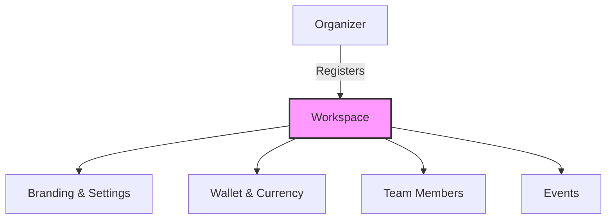

---

## 2. Event Creation & Management
**Logic:**
- Events are created within a Workspace. 
- An event contains core metadata (Title, Description, Dates, Venue references).
- Once an event is created, it unlocks the suite of event-specific sub-features (Staffing, Sections, RSVPs, Ticket Design, Badge Design).
- **Database Table:** `events`

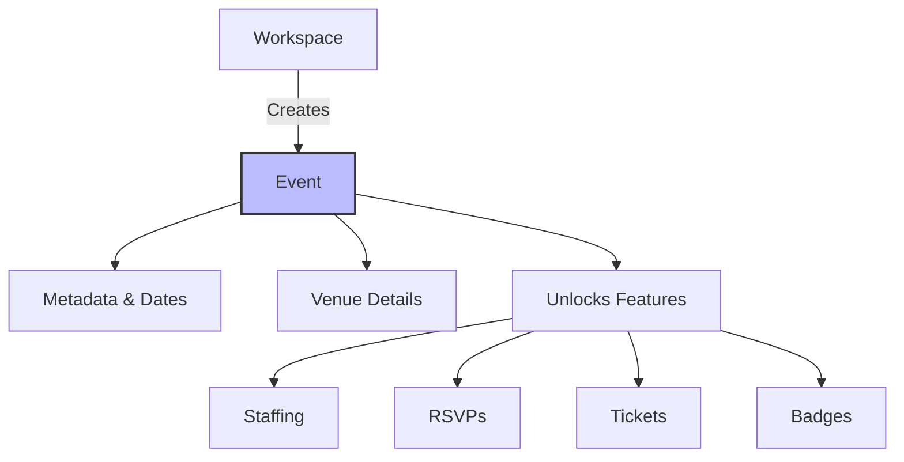

---

## 3. Form Creation (RSVPs / Questionnaires)
**Logic:**
- Custom forms can be generated to collect data from attendees or potential staff.
- **Dynamic Fields:** Form configurations are stored as a JSONB array, allowing organizers to dynamically drag-and-drop text inputs, checkboxes, and image upload fields.
- **Data Collection:** When users submit a form, their answers are stored in `rsvp_answers` as a structured JSON object. 
- **Staff Onboarding:** You can easily map RSVP form answers (like Profile Picture, First Name, Last Name) directly into the Staff Directory via Bulk Import.

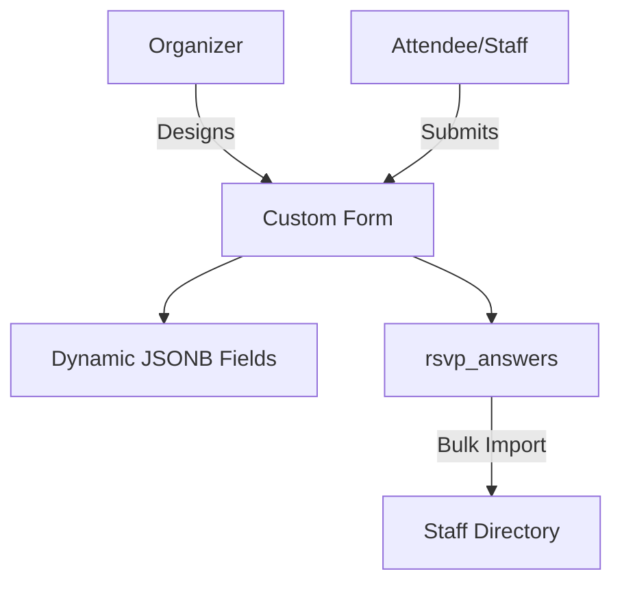

---

## 4. Punch Card Sections (Event Sections)
**Logic:**
- **Sections** represent physical zones or checkpoints within an event (e.g., "Main Gate", "VIP Lounge", "Backstage").
- Organizers define these sections in the dashboard.
- These sections serve as the foundation for **Access Control**. When configuring a staff member's or attendee's credential, you assign them specific `allowed_sections` (stored as an array of UUIDs).
- **Database Table:** `event_sections`

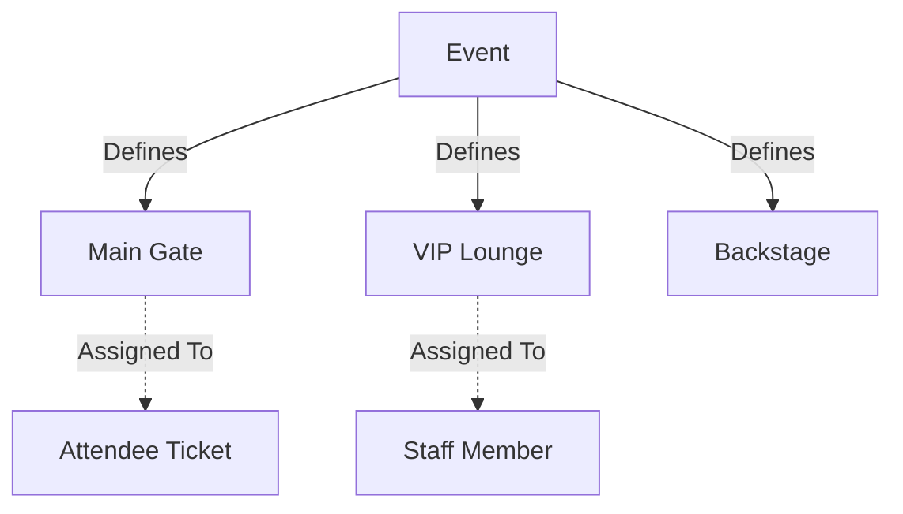

---

## 5. Staff Management (Import & Add)
**Logic:**
- Staff members are tied specifically to an `event_id`.
- **Adding Staff:** You can add staff manually one-by-one via the `AddStaffModal` or Bulk Import them from external Vendor forms.
- **Access Control:** Every staff member is assigned an `allowed_sections` JSONB array. 
  - If it contains `["*"]`, the staff member has **ALL ACCESS**.
  - If it contains specific IDs (e.g., `["uuid-1", "uuid-2"]`), they are restricted to those zones.
  - If it is empty `[]`, they have **NO ACCESS** to gated zones.
- **Unique Credentials:** Upon creation, a secure, unique `badge_qr_string` (e.g., `STAFF-XYZ123`) is generated for that staff member.
- **Database Table:** `event_staff`

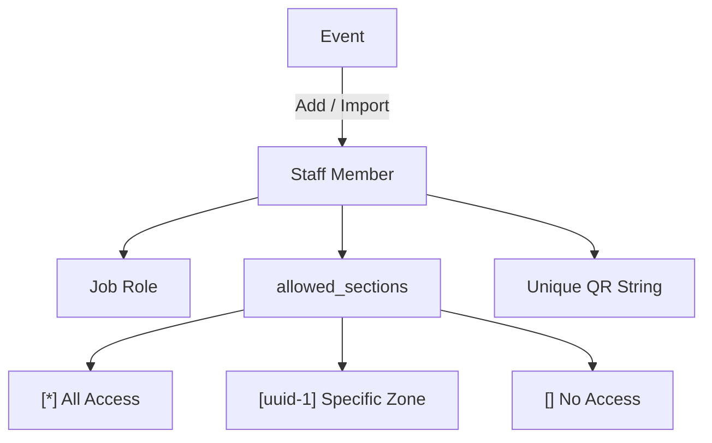

---

## 6. Digital Badge Creation (Badge Designer)
**Logic:**
- The Badge Designer allows organizers to visually customize digital IDs for their staff.
- **Config:** The visual configuration (theme, font, gradient, sponsor logos, QR code placement) is saved in the `badge_projects` table under a specific `event_id`.
- **Dynamic Rendering:** When rendering a badge (via the `BadgePreview` component), the system merges the visual configuration from `badge_projects` with the personal data from `event_staff` (Name, Role, Initials, Profile Image, and QR Code).
- **Security:** The dynamic rendering means that if a staff member's role or access changes, their live digital badge reflects it instantly without needing to reprint anything.

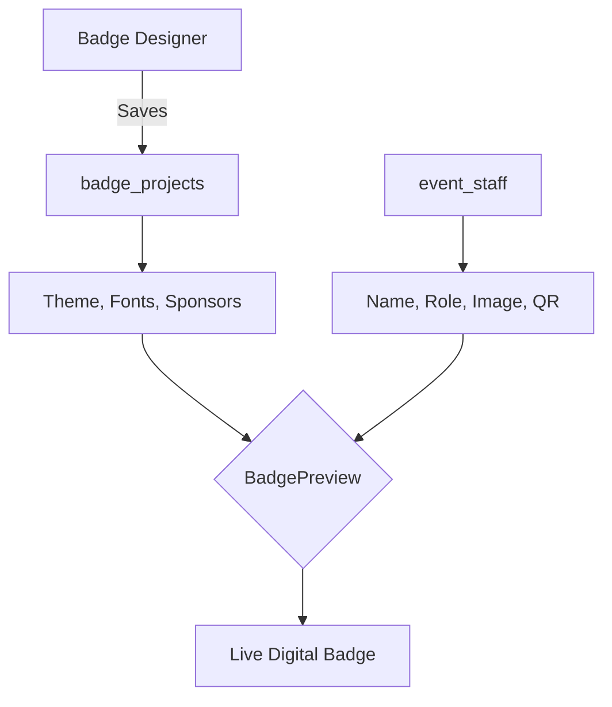

---

## 7. Ticket Creation & Design
**Logic:**
- Similar to Badge Creation, organizers use the `Ticket Designer` to visually construct the digital tickets that attendees receive upon purchase.
- **Config:** The design payload is stored in `ticket_projects` (tied to an event).
- **Issuance:** When an attendee purchases a ticket or RSVPs, a unique record is created in the `tickets` table with a secure `qr_string` (e.g., `TKT-987ABC`).
- **Dynamic Merging:** The public ticket route merges the organizer's Ticket Design with the buyer's data (Name, Ticket Type, QR Code) to present a beautiful Apple Wallet-style digital pass.
- **Scanning:** Tickets are scanned at the "Main Gate" sections to validate entry and prevent duplicate check-ins.

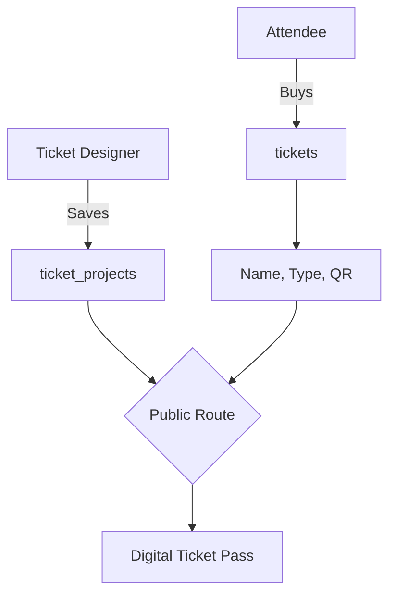

---

## 8. Badge & Ticket Scanning (Access Control)

### A. Agatike Scanner App (For Security Personnel)
- **Logic:** The security guard selects their current location (e.g., "VIP Lounge") in the `ScannerMobile` view.
- When they scan a credential QR code, the system fetches the record via the string.
- **Validation:** 
  1. Checks if status `=== "active"`.
  2. Checks if `allowed_sections` includes `"*"` (All Access).
  3. If not all access, checks if `allowed_sections` includes the ID of the guard's current location.
- Returns a distinct Green "Access Granted" or Red "Access Denied" full-screen alert.

### B. Public Verification Route (For Standard Cameras)
- **Logic:** The QR code printed on the digital badge actually embeds a full URL: `https://app.agatike.com/b/[badge_qr_string]`.
- If an attendee or guard scans it with a normal iOS/Android camera, it opens the `/b/$qrString` public route.
- **Security Features:**
  - This route fetches the user's data and their event's custom Badge Design and renders an authentic digital credential on the phone screen.
  - To prevent screenshotting or credential sharing, a **60-Second Auto-Expiration Timer** runs. Once it hits zero, the badge disappears and the user must re-scan the QR code.
  - Hides the dashboard mobile navigation bar completely to prevent unauthorized navigation.

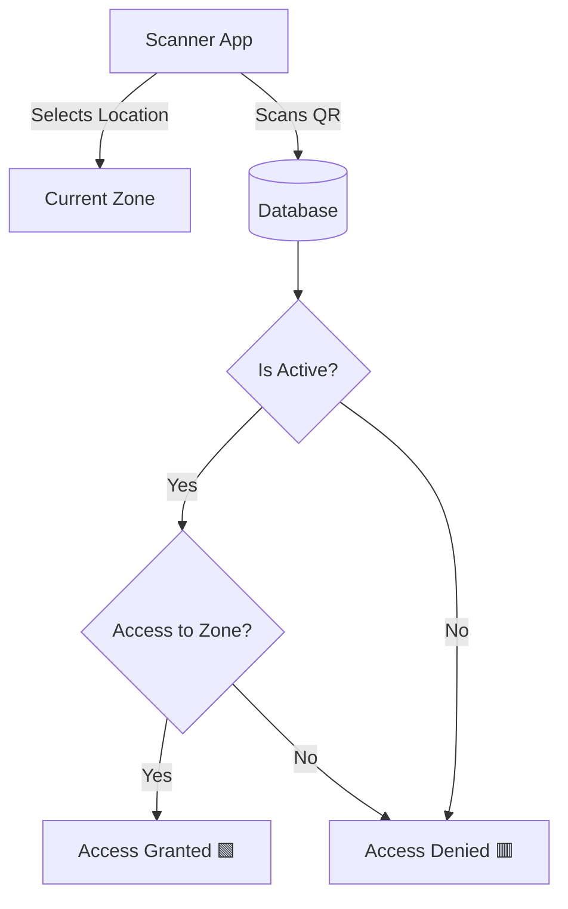

---

## 9. Products, Add-ons, Punch Cards & Vouchers
**Logic:**
- Organizers can create digital and physical merchandise to sell or distribute to attendees.
- **Punch Cards:** A pre-paid digital asset that holds a specific `punch_count` (e.g., 5 Free Drinks). When scanned, the Agatike Scanner App decrements the punch count by 1 (simulating a hole punch) until the card reaches 0.
- **Vouchers:** A digital gift card or wallet loaded with a specific monetary `value_amount` (e.g., $60 Food & Drink Voucher).
- **Loyalty Cards:** An earned asset where users accumulate stamps (up to `punch_count`) to redeem a `reward_description` (e.g., 10 stamps = 1 Free Drink).
- **Physical Merch:** Standard trackable inventory (e.g., T-Shirts, Posters).
- **Database Table:** `products` (using `type` = `punch_card`, `voucher`, `loyalty_card`, or `physical`)

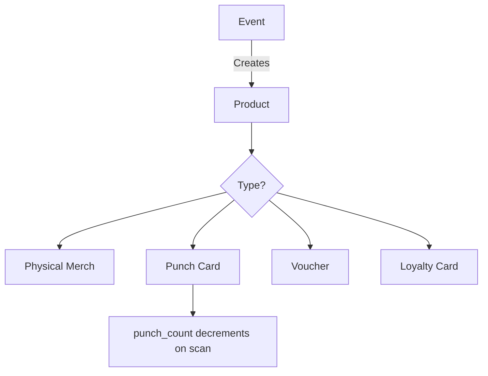

---

## 10. Vendor Creation
**Logic:**
- Vendors operate similarly to staff or sub-organizers but typically manage their own products, stalls, or add-ons within an event context.
- Allows event organizers to monetize physical space by onboarding external vendors into the event ecosystem and tracking their specific sales.

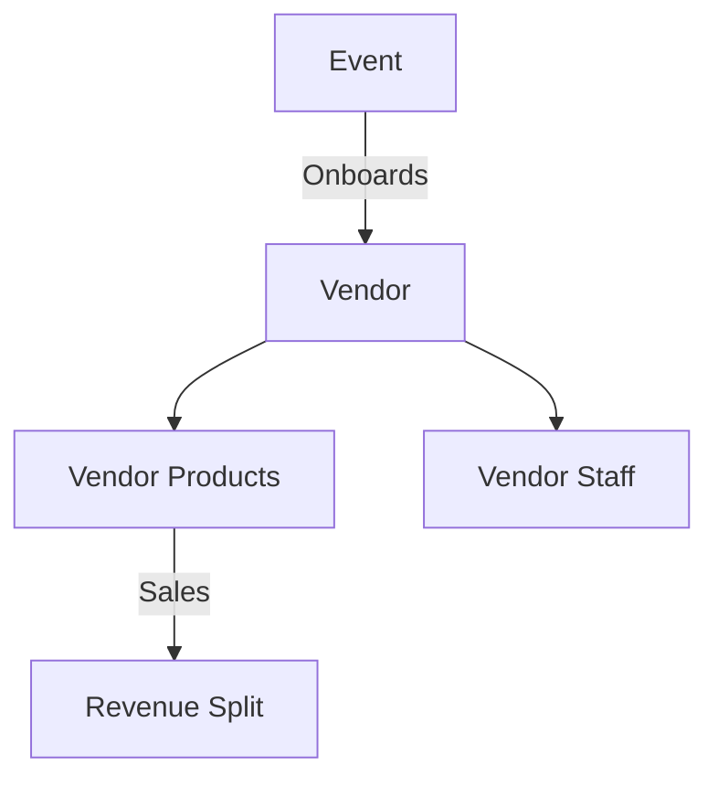

---

## 11. Wallets & Withdrawals (Financials)
**Logic:**
- **Wallets:** Every Workspace has a dedicated Wallet (`wallets` table) that tracks their aggregate balance across all events.
- **Transaction Ledger:** The `wallet_transactions` table acts as a double-entry ledger tracking money moving in and out of the workspace.
  - **Credits:** Incoming funds from ticket sales or merchandise.
  - **Debits:** Outgoing funds when an organizer requests a withdrawal.
- **Withdrawal Requests:** Organizers request payouts (via MTN MoMo, Bank Transfer, etc.) from the Withdrawals Dashboard. This inserts a `pending` Debit transaction.
- **Reconciliation:** The admin or automated system processes the payout and updates the `status` to `completed`, referencing the external payout provider's ID.

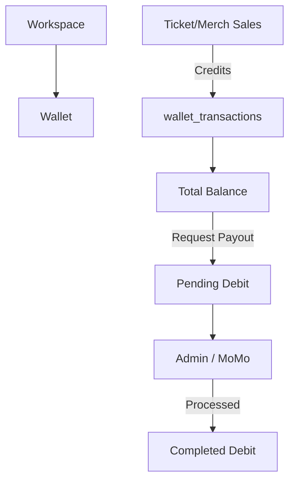

---

## 12. Currency & Payment Provider Logic (MTN MoMo)
**Logic:**
- **Wallet Scoped Currency:** When a Workspace Wallet is created, it is assigned a specific 3-letter ISO `currency` code (e.g., `RWF`, `USD`, `EUR`). This acts as the default currency for the entire workspace.
- **Strict Currency Formatting:** The frontend strictly uses the `Intl.NumberFormat` API dynamically localized to the Wallet's assigned currency. String literals like "dollars" will crash the formatter, so the system enforces strict sanitization.
- **Global Scaling:** By relying on `Intl.NumberFormat("en-US", { style: "currency", currency: wallet.currency })`, an American organizer will see **$50.00** while a Rwandan organizer seamlessly sees **RWF 50,000** without needing hardcoded symbols.
- **Provider Metadata:** To accommodate telecom integrations like **MTN MoMo**, the `wallet_transactions` table strictly tracks:
  - `amount`: The gross amount.
  - `net_amount`: The amount after platform/gateway fees.
  - `fee`: The exact fee deducted.
  - `provider_reference`: The external transaction ID from MTN MoMo.
  - `provider_status`: The raw status returned by MTN MoMo (e.g., "SUCCESSFUL", "FAILED").
  - `payout_method` & `payout_account`: How and where the money was sent (e.g., "momo" / "+250788123456").

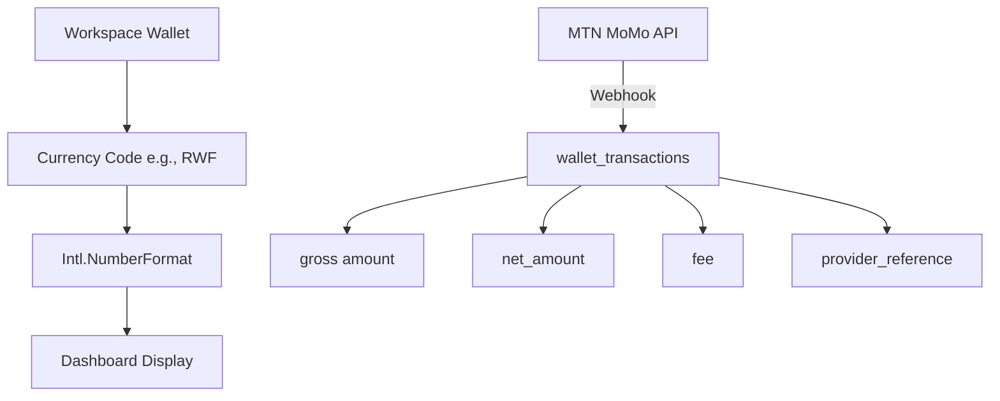

---

## Routing Architecture Reminder

This app uses **TanStack Start** file-based routing.

| File Pattern             | URL                                                     |
| ------------------------ | ------------------------------------------------------- |
| `index.tsx`              | `/`                                                     |
| `dashboard.$slug.tsx`    | `/dashboard/:slug`                                      |
| `b.$qrString.tsx`        | `/b/:qrString` (Public Verification Route)              |
| `__root.tsx`             | The global app shell layout                             |

*Note: The old README located at `src/routes/README.md` has been moved and merged into this central root `README.md`.*
