# Agatike Connect - Architecture & Logic Documentation

Welcome to the **Agatike Connect** repository! This document serves as the comprehensive guide to the core logic, features, and database workflows implemented in this application.

This project uses **TanStack Start** for file-based routing, **React Query** for server state, and **Hasura (GraphQL)** for database interactions.

---

## 1. Workspaces & Organizer Profile Setup

**Logic:**

- **Workspaces** act as the top-level organizational unit (Tenant). Every organizer, company, or team operates within a workspace.
- **Organizer Setup:** When a user registers as an organizer, they create a Workspace. This workspace holds their branding, payout accounts, and overarching team members.
- **Data Isolation:** All major entities (Events, Venues, Staff, RSVPs, Wallets, Transactions) are strictly tied to a `workspace_id`. This guarantees multi-tenant security so one organizer cannot see another's data.
- **Routing:** Most dashboard routes are nested under `/dashboard/$workspaceSlug/...` allowing context to dynamically flow through the `WorkspaceProvider`.

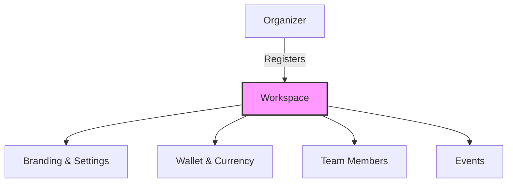
```mermaid
flowchart TD
  User[Organizer] -->|Registers| WS[Workspace]
  WS --> Brand[Branding & Settings]
  WS --> Wallet[Wallet & Currency]
  WS --> Teams[Team Members]
  WS --> Events[Events]

  style WS fill:#f9f,stroke:#333,stroke-width:2px
```

---

## 2. Event Creation & Management

**Logic:**

- Events are created within a Workspace.
- An event contains core metadata (Title, Description, Dates, Venue references).
- Once an event is created, it unlocks the suite of event-specific sub-features (Staffing, Sections, RSVPs, Ticket Design, Badge Design).
- **Database Table:** `events`

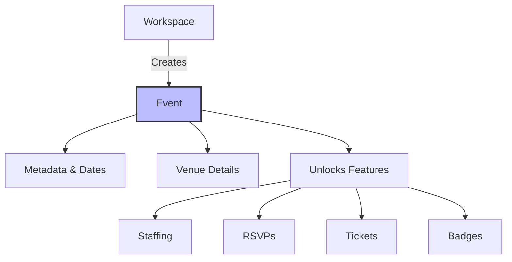
```mermaid
flowchart TD
  WS[Workspace] -->|Creates| Event[Event]
  Event --> Meta[Metadata & Dates]
  Event --> Venue[Venue Details]
  Event --> Unlocks[Unlocks Features]
  Unlocks --> Staffing
  Unlocks --> RSVPs
  Unlocks --> Tickets
  Unlocks --> Badges

  style Event fill:#bbf,stroke:#333,stroke-width:2px
```

---

## 3. Form Creation (RSVPs / Questionnaires)

**Logic:**

- Custom forms can be generated to collect data from attendees or potential staff.
- **Dynamic Fields:** Form configurations are stored as a JSONB array, allowing organizers to dynamically drag-and-drop text inputs, checkboxes, and image upload fields.
- **Data Collection:** When users submit a form, their answers are stored in `rsvp_answers` as a structured JSON object.
- **Staff Onboarding:** You can easily map RSVP form answers (like Profile Picture, First Name, Last Name) directly into the Staff Directory via Bulk Import.

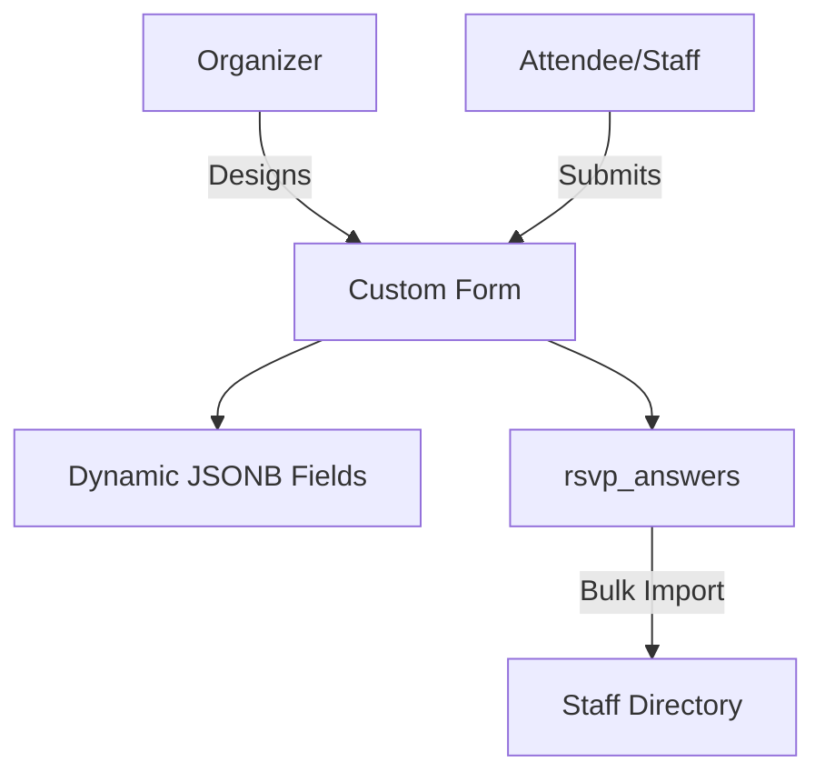
```mermaid
flowchart TD
  Org[Organizer] -->|Designs| Form[Custom Form]
  Form --> Fields[Dynamic JSONB Fields]
  User[Attendee/Staff] -->|Submits| Form
  Form --> Answers[rsvp_answers]
  Answers -->|Bulk Import| StaffDir[Staff Directory]
```

---

## 4. Punch Card Sections (Event Sections)

**Logic:**

- **Sections** represent physical zones or checkpoints within an event (e.g., "Main Gate", "VIP Lounge", "Backstage").
- Organizers define these sections in the dashboard.
- These sections serve as the foundation for **Access Control**. When configuring a staff member's or attendee's credential, you assign them specific `allowed_sections` (stored as an array of UUIDs).
- **Database Table:** `event_sections`

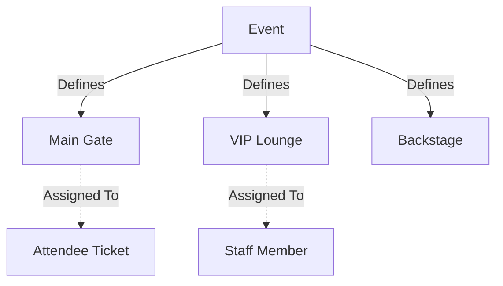
```mermaid
flowchart TD
  Event[Event] -->|Defines| SecA[Main Gate]
  Event -->|Defines| SecB[VIP Lounge]
  Event -->|Defines| SecC[Backstage]
  SecB -.->|Assigned To| Staff[Staff Member]
  SecA -.->|Assigned To| Tkt[Attendee Ticket]
```

---

## 5. Staff Management (Import & Add)

**Logic:**

- Staff members are tied specifically to an `event_id`.
- **Adding Staff:** You can add staff manually one-by-one via the `AddStaffModal` or Bulk Import them from external Vendor forms.
- **Access Control:** Every staff member is assigned an `allowed_sections` JSONB array.
  - If it contains `["*"]`, the staff member has **ALL ACCESS**.
  - If it contains specific IDs (e.g., `["uuid-1", "uuid-2"]`), they are restricted to those zones.
  - If it is empty `[]`, they have **NO ACCESS** to gated zones.
- **Unique Credentials:** Upon creation, a secure, unique `badge_qr_string` (e.g., `STAFF-XYZ123`) is generated for that staff member.
- **Database Table:** `event_staff`

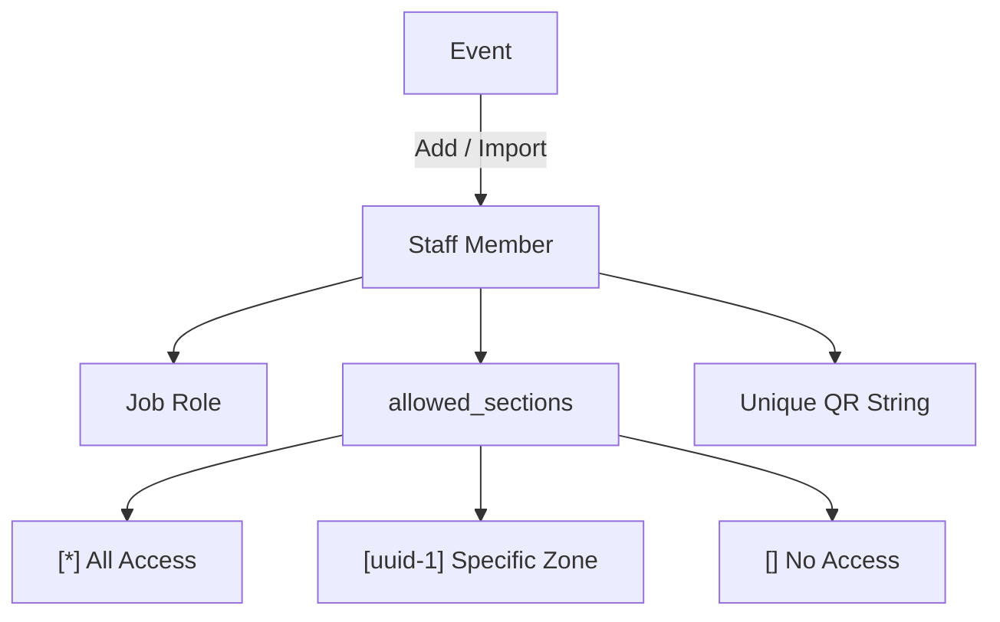
```mermaid
flowchart TD
  Event -->|Add / Import| Staff[Staff Member]
  Staff --> Role[Job Role]
  Staff --> Access[allowed_sections]
  Access --> AllAccess["[*] All Access"]
  Access --> Partial["[uuid-1] Specific Zone"]
  Access --> None["[] No Access"]
  Staff --> QR[Unique QR String]
```

---

## 6. Digital Badge Creation (Badge Designer)

**Logic:**

- The Badge Designer allows organizers to visually customize digital IDs for their staff.
- **Config:** The visual configuration (theme, font, gradient, sponsor logos, QR code placement) is saved in the `badge_projects` table under a specific `event_id`.
- **Dynamic Rendering:** When rendering a badge (via the `BadgePreview` component), the system merges the visual configuration from `badge_projects` with the personal data from `event_staff` (Name, Role, Initials, Profile Image, and QR Code).
- **Security:** The dynamic rendering means that if a staff member's role or access changes, their live digital badge reflects it instantly without needing to reprint anything.

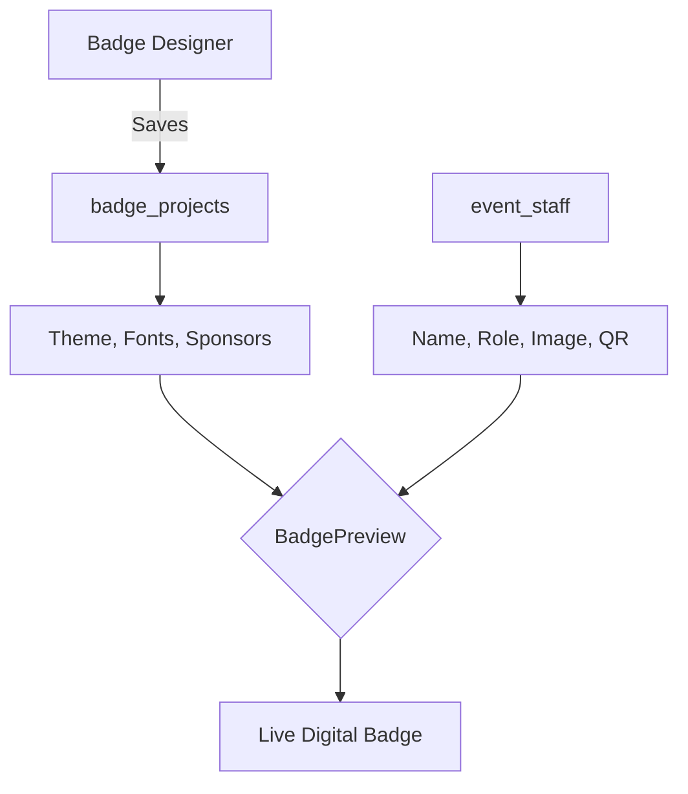
```mermaid
flowchart TD
  Designer[Badge Designer] -->|Saves| Proj[badge_projects]
  Proj --> Config[Theme, Fonts, Sponsors]
  StaffDB[event_staff] --> Data[Name, Role, Image, QR]
  Config --> Merge{BadgePreview}
  Data --> Merge
  Merge --> Rendered[Live Digital Badge]
```

---

## 7. Ticket Creation & Design

**Logic:**

- Similar to Badge Creation, organizers use the `Ticket Designer` to visually construct the digital tickets that attendees receive upon purchase.
- **Config:** The design payload is stored in `ticket_projects` (tied to an event).
- **Issuance:** When an attendee purchases a ticket or RSVPs, a unique record is created in the `tickets` table with a secure `qr_string` (e.g., `TKT-987ABC`).
- **Dynamic Merging:** The public ticket route merges the organizer's Ticket Design with the buyer's data (Name, Ticket Type, QR Code) to present a beautiful Apple Wallet-style digital pass.
- **Scanning:** Tickets are scanned at the "Main Gate" sections to validate entry and prevent duplicate check-ins.

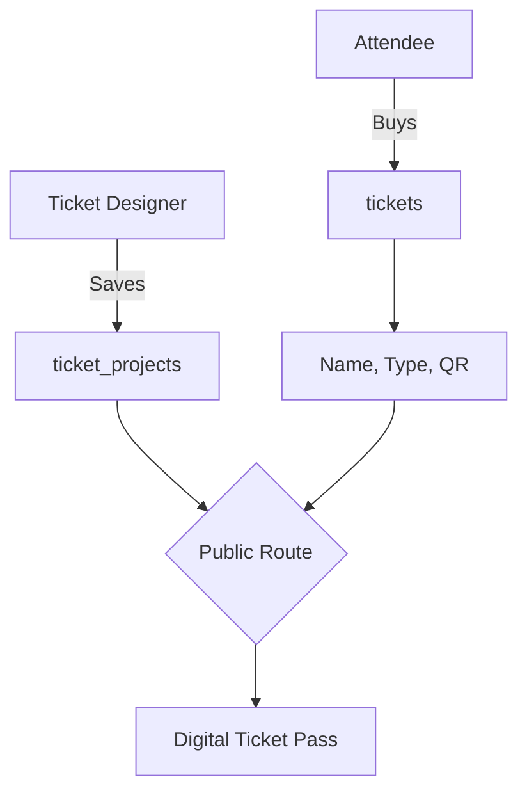
```mermaid
flowchart TD
  Designer[Ticket Designer] -->|Saves| TktProj[ticket_projects]
  Purchaser[Attendee] -->|Buys| TicketDB[tickets]
  TicketDB --> TktData[Name, Type, QR]
  TktProj --> Merge{Public Route}
  TktData --> Merge
  Merge --> AppleWallet[Digital Ticket Pass]
```

---

## 8. Badge & Ticket Scanning (Access Control)

### A. Agatike Scanner App (For Security Personnel)

- **Logic:** The security guard selects their current location (e.g., "VIP Lounge") in the `ScannerMobile` view.
- When they scan a credential QR code, the system fetches the record via the string.
- **Validation:**
  1. Checks if status `=== "active"`.
  2. Checks if `allowed_sections` includes `"*"` (All Access).
  3. If not all access, checks if `allowed_sections` includes the ID of the guard's current location.
- Returns a distinct Green "Access Granted" or Red "Access Denied" full-screen alert.

### B. Public Verification Route (For Standard Cameras)

- **Logic:** The QR code printed on the digital badge actually embeds a full URL: `https://app.agatike.com/b/[badge_qr_string]`.
- If an attendee or guard scans it with a normal iOS/Android camera, it opens the `/b/$qrString` public route.
- **Security Features:**
  - This route fetches the user's data and their event's custom Badge Design and renders an authentic digital credential on the phone screen.
  - To prevent screenshotting or credential sharing, a **60-Second Auto-Expiration Timer** runs. Once it hits zero, the badge disappears and the user must re-scan the QR code.
  - Hides the dashboard mobile navigation bar completely to prevent unauthorized navigation.

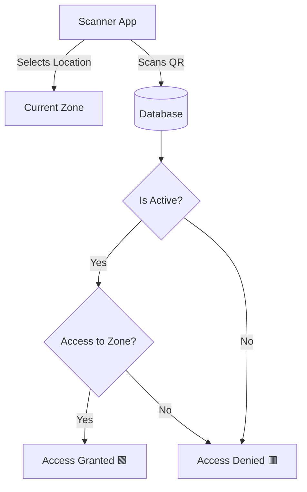
```mermaid
flowchart TD
  Scanner[Scanner App] -->|Selects Location| Loc[Current Zone]
  Scanner -->|Scans QR| DB[(Database)]
  DB --> CheckActive{Is Active?}
  CheckActive -->|Yes| CheckZone{Access to Zone?}
  CheckActive -->|No| Denied[Access Denied 🟥]
  CheckZone -->|Yes| Granted[Access Granted 🟩]
  CheckZone -->|No| Denied
```

---

## 9. Products, Add-ons, Punch Cards & Vouchers

**Logic:**

- Organizers can create digital and physical merchandise to sell or distribute to attendees.
- **Punch Cards:** A pre-paid digital asset that holds a specific `punch_count` (e.g., 5 Free Drinks). When scanned, the Agatike Scanner App decrements the punch count by 1 (simulating a hole punch) until the card reaches 0.
- **Vouchers:** A digital gift card or wallet loaded with a specific monetary `value_amount` (e.g., $60 Food & Drink Voucher).
- **Loyalty Cards:** An earned asset where users accumulate stamps (up to `punch_count`) to redeem a `reward_description` (e.g., 10 stamps = 1 Free Drink).
- **Physical Merch:** Standard trackable inventory (e.g., T-Shirts, Posters).
- **Database Table:** `products` (using `type` = `punch_card`, `voucher`, `loyalty_card`, or `physical`)

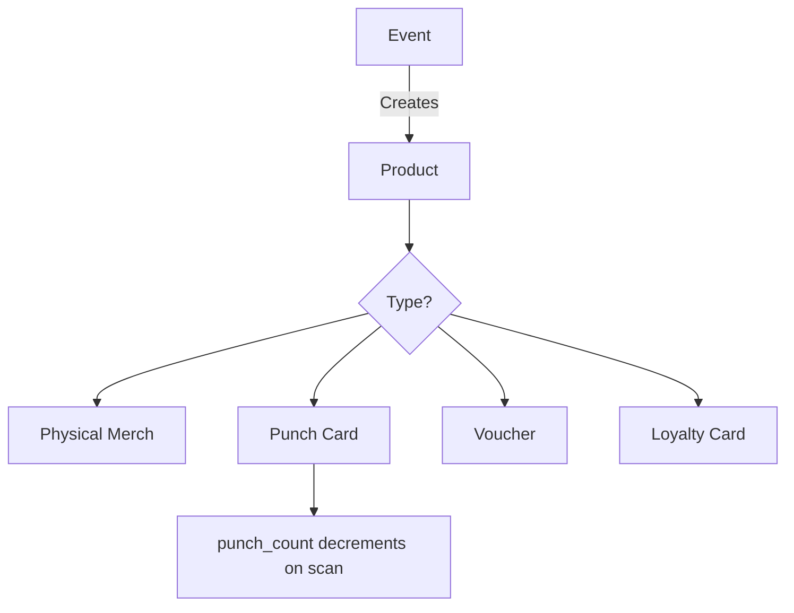
```mermaid
flowchart TD
  Event -->|Creates| Product[Product]
  Product --> Type{Type?}
  Type --> Physical[Physical Merch]
  Type --> Punch[Punch Card]
  Type --> Voucher[Voucher]
  Type --> Loyalty[Loyalty Card]
  Punch --> Uses[punch_count decrements on scan]
```

---

## 10. Vendor Creation

**Logic:**

- Vendors operate similarly to staff or sub-organizers but typically manage their own products, stalls, or add-ons within an event context.
- Allows event organizers to monetize physical space by onboarding external vendors into the event ecosystem and tracking their specific sales.

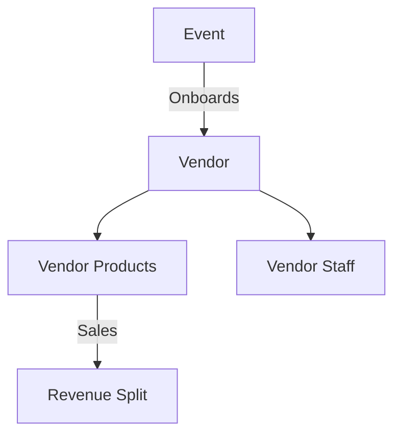
```mermaid
flowchart TD
  Event -->|Onboards| Vendor[Vendor]
  Vendor --> Products[Vendor Products]
  Vendor --> Staff[Vendor Staff]
  Products -->|Sales| Revenue[Revenue Split]
```

---

## 11. Wallets & Withdrawals (Financials)

**Logic:**

- **Wallets:** Every Workspace has a dedicated Wallet (`wallets` table) that tracks their aggregate balance across all events.
- **Transaction Ledger:** The `wallet_transactions` table acts as a double-entry ledger tracking money moving in and out of the workspace.
  - **Credits:** Incoming funds from ticket sales or merchandise.
  - **Debits:** Outgoing funds when an organizer requests a withdrawal.
- **Withdrawal Requests:** Organizers request payouts (via MTN MoMo, Bank Transfer, etc.) from the Withdrawals Dashboard. This inserts a `pending` Debit transaction.
- **Reconciliation:** The admin or automated system processes the payout and updates the `status` to `completed`, referencing the external payout provider's ID.

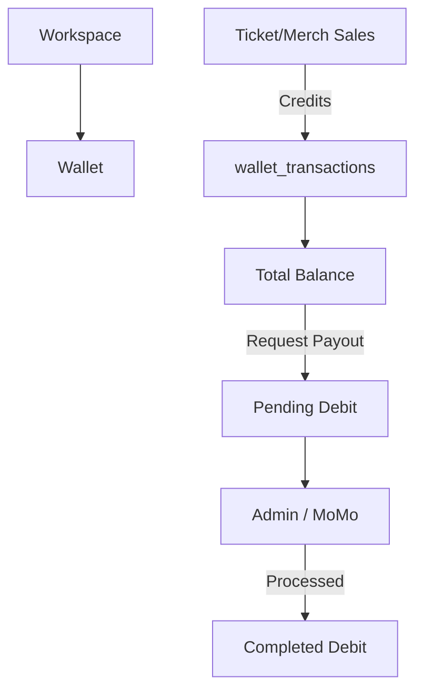
```mermaid
flowchart TD
  WS[Workspace] --> Wallet[Wallet]
  Sales[Ticket/Merch Sales] -->|Credits| Ledger[wallet_transactions]
  Ledger --> Balance[Total Balance]
  Balance -->|Request Payout| Withdraw[Pending Debit]
  Withdraw --> Admin[Admin / MoMo]
  Admin -->|Processed| Completed[Completed Debit]
```

---

## 12. Currency & Payment Provider Logic (MTN MoMo)

**Logic:**

- **Wallet Scoped Currency:** When a Workspace Wallet is created, it is assigned a specific 3-letter ISO `currency` code (e.g., `RWF`, `USD`, `EUR`). This acts as the default currency for the entire workspace.
- **Strict Currency Formatting:** The frontend strictly uses the `Intl.NumberFormat` API dynamically localized to the Wallet's assigned currency. String literals like "dollars" will crash the formatter, so the system enforces strict sanitization.
- **Global Scaling:** By relying on `Intl.NumberFormat("en-US", { style: "currency", currency: wallet.currency })`, an American organizer will see **$50.00** while a Rwandan organizer seamlessly sees **RWF 50,000** without needing hardcoded symbols.
- **Provider Metadata:** To accommodate telecom integrations like **MTN MoMo**, the `wallet_transactions` table strictly tracks:
  - `amount`: The gross amount.
  - `net_amount`: The amount after platform/gateway fees.
  - `fee`: The exact fee deducted.
  - `provider_reference`: The external transaction ID from MTN MoMo.
  - `provider_status`: The raw status returned by MTN MoMo (e.g., "SUCCESSFUL", "FAILED").
  - `payout_method` & `payout_account`: How and where the money was sent (e.g., "momo" / "+250788123456").

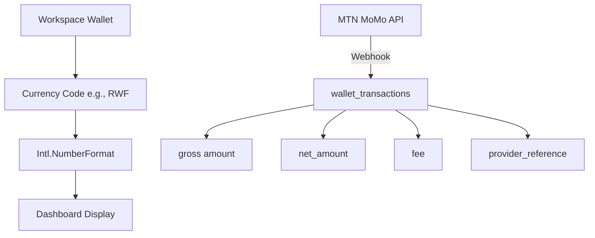
```mermaid
flowchart TD
  Wallet[Workspace Wallet] --> Curr[Currency Code e.g., RWF]
  Curr --> Formatter[Intl.NumberFormat]
  Formatter --> UI[Dashboard Display]
  MoMo[MTN MoMo API] -->|Webhook| Ledger[wallet_transactions]
  Ledger --> Gross[gross amount]
  Ledger --> Net[net_amount]
  Ledger --> Fee[fee]
  Ledger --> Ref[provider_reference]
```

---

## Routing Architecture Reminder

This app uses **TanStack Start** file-based routing.

| File Pattern          | URL                                        |
| --------------------- | ------------------------------------------ |
| `index.tsx`           | `/`                                        |
| `dashboard.$slug.tsx` | `/dashboard/:slug`                         |
| `b.$qrString.tsx`     | `/b/:qrString` (Public Verification Route) |
| `__root.tsx`          | The global app shell layout                |

_Note: The old README located at `src/routes/README.md` has been moved and merged into this central root `README.md`._

---

## 13. Budget & Settlement (`/planning`)

**Route:** `/dashboard/$workspaceSlug/events/$eventId/planning`  
**File:** `src/routes/dashboard.$workspaceSlug.events.$eventId.planning.tsx`

The Budget & Settlement page is the **financial command centre** for an event. It is structured as a 4-tab interface, each with a dedicated sub-component.

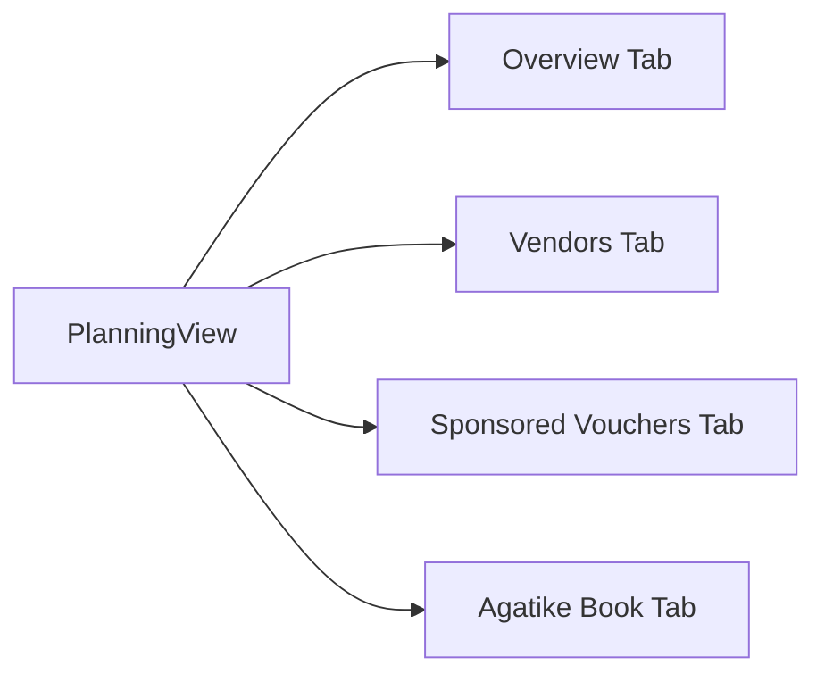
```mermaid
graph LR
    PlanningView --> OV[Overview Tab]
    PlanningView --> VE[Vendors Tab]
    PlanningView --> VO[Sponsored Vouchers Tab]
    PlanningView --> BK[Agatike Book Tab]
```

---

### 13.1 Vendors Tab

Vendors are physical stalls or service providers at the event who can accept sponsored vouchers as payment.

**Key Logic:**
- On creation, each vendor is auto-assigned a system ID: `VND-` + 6 random alphanumeric characters (e.g. `VND-AB3K7F`). This ID is used by the Agatike Scanner app to identify the vendor terminal.
- Clicking any vendor card opens a **Ledger Modal** showing every voucher transaction they have processed, with date, description, voucher QR code, and amount.
- The ledger can be **exported to CSV** via a browser Blob download, with proper quote-escaping on text fields.

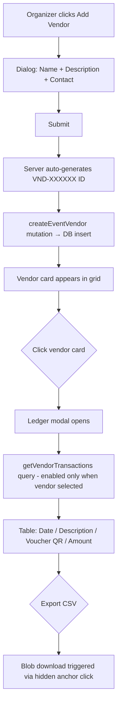
```mermaid
flowchart TD
    A[Organizer clicks Add Vendor] --> B[Dialog: Name + Description + Contact]
    B --> C[Submit]
    C --> D[Server auto-generates VND-XXXXXX ID]
    D --> E[createEventVendor mutation → DB insert]
    E --> F[Vendor card appears in grid]
    F --> G{Click vendor card}
    G --> H[Ledger modal opens]
    H --> I[getVendorTransactions query - enabled only when vendor selected]
    I --> J[Table: Date / Description / Voucher QR / Amount]
    J --> K{Export CSV}
    K --> L[Blob download triggered via hidden anchor click]
```

**Database table:** `event_vendors`

---

### 13.2 Sponsored Vouchers Tab

Sponsored Vouchers are digital credit instruments issued to attendees. The system supports two distinct campaign types:

| Type | Behaviour |
|---|---|
| **Standalone Batch** | N voucher QR codes are pre-generated immediately with a fixed monetary value |
| **Ticket-Attached** | No vouchers pre-generated; one voucher is created automatically when a qualifying ticket is purchased |

**Voucher Value Types (Ticket-Attached only):**
- `match_ticket_price` — Voucher value = the cost of the ticket that triggered it
- `fixed` — Voucher value = a custom RWF amount defined by the organizer

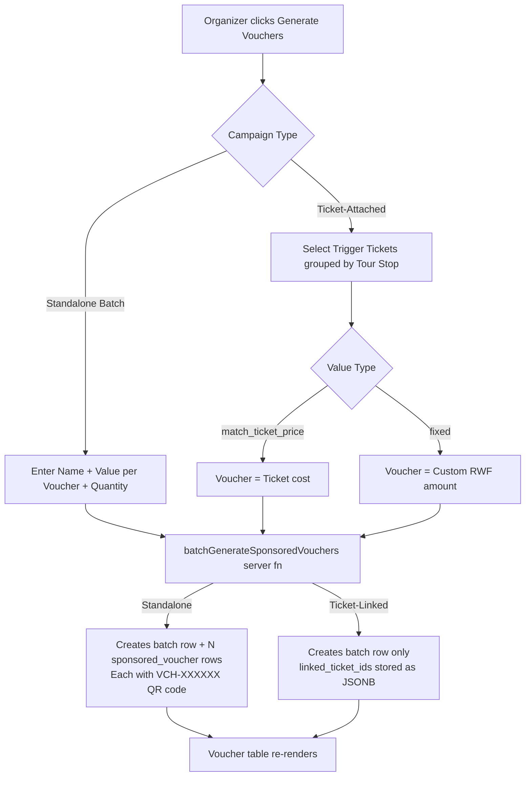
```mermaid
flowchart TD
    A[Organizer clicks Generate Vouchers] --> B{Campaign Type}
    B -->|Standalone Batch| C[Enter Name + Value per Voucher + Quantity]
    B -->|Ticket-Attached| D[Select Trigger Tickets grouped by Tour Stop]
    D --> E{Value Type}
    E -->|match_ticket_price| F[Voucher = Ticket cost]
    E -->|fixed| G[Voucher = Custom RWF amount]
    C & F & G --> H[batchGenerateSponsoredVouchers server fn]
    H -->|Standalone| I[Creates batch row + N sponsored_voucher rows\nEach with VCH-XXXXXX QR code]
    H -->|Ticket-Linked| J[Creates batch row only\nlinked_ticket_ids stored as JSONB]
    I & J --> K[Voucher table re-renders]
```

**Pagination:** The voucher table supports 10/20/50/100 rows per page using client-side slicing (`vouchers.slice((currentPage-1)*pageSize, currentPage*pageSize)`).

**Analytics (computed client-side):**
- `totalProvisioned` = sum of `current_balance + voucher_transactions.sum` per voucher
- `totalSpent` = sum of all transaction amounts
- `totalRemaining` = sum of current balances

**Database tables:** `sponsored_voucher_batches`, `sponsored_vouchers`, `voucher_transactions`

---

### 13.3 Agatike Book Tab (Custom Book Builder)

The Agatike Book is a fully flexible, custom spreadsheet/database builder — similar in concept to Notion or Airtable — where organizers can track anything about their event in a structured tabular format.

#### Two-Step Builder Flow

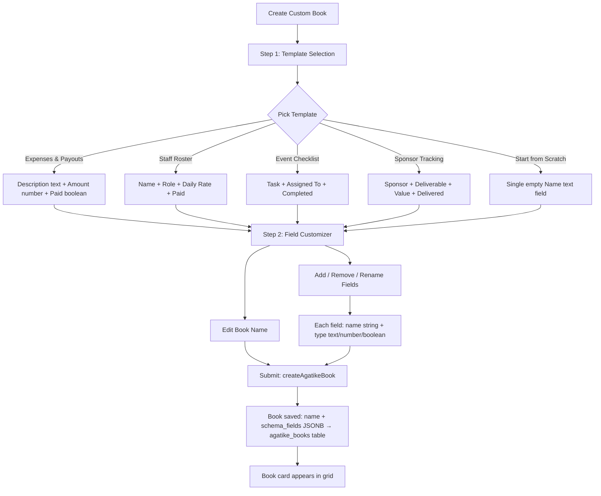
```mermaid
flowchart TD
    A[Create Custom Book] --> B[Step 1: Template Selection]
    B --> C{Pick Template}
    C -->|Expenses & Payouts| D[Description text + Amount number + Paid boolean]
    C -->|Staff Roster| E[Name + Role + Daily Rate + Paid]
    C -->|Event Checklist| F[Task + Assigned To + Completed]
    C -->|Sponsor Tracking| G[Sponsor + Deliverable + Value + Delivered]
    C -->|Start from Scratch| H[Single empty Name text field]
    D & E & F & G & H --> I[Step 2: Field Customizer]
    I --> J[Edit Book Name]
    I --> K[Add / Remove / Rename Fields]
    K --> L[Each field: name string + type text/number/boolean]
    J & L --> M[Submit: createAgatikeBook]
    M --> N[Book saved: name + schema_fields JSONB → agatike_books table]
    N --> O[Book card appears in grid]
```

#### Record Management Flow

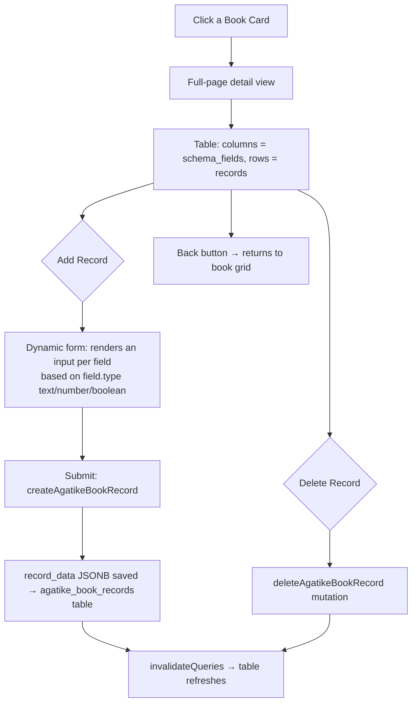
```mermaid
flowchart TD
    A[Click a Book Card] --> B[Full-page detail view]
    B --> C[Table: columns = schema_fields, rows = records]
    C --> D{Add Record}
    D --> E[Dynamic form: renders an input per field\nbased on field.type text/number/boolean]
    E --> F[Submit: createAgatikeBookRecord]
    F --> G[record_data JSONB saved → agatike_book_records table]
    G --> H[invalidateQueries → table refreshes]
    C --> I{Delete Record}
    I --> J[deleteAgatikeBookRecord mutation]
    J --> H
    C --> K[Back button → returns to book grid]
```

#### Field Types

| Type | UI Control | Stored As |
|---|---|---|
| `text` | `<Input type="text">` | string |
| `number` | `<Input type="number">` | numeric string |
| `boolean` | `<Checkbox>` | `true / false` |

#### Data Schema

`agatike_books.schema_fields` (JSONB):
```json
[
  { "name": "Description", "type": "text" },
  { "name": "Amount", "type": "number" },
  { "name": "Paid", "type": "boolean" }
]
```

`agatike_book_records.record_data` (JSONB):
```json
{
  "Description": "Sound Equipment Hire",
  "Amount": "150000",
  "Paid": true
}
```

**Data sync pattern:** A `useEffect` watches both `books` (refetched after mutations) and `activeBook`. When data updates, it finds the updated book object by ID and re-syncs `activeBook` so the table always displays fresh records without resetting the user's navigation state.

**Database tables:** `agatike_books`, `agatike_book_records`

---

### 13.4 Overview Tab (Financial Dashboard)

The Overview Tab aggregates live data from all three other tabs — Tickets, Vendors, Vouchers, and Agatike Books — into a single financial snapshot.

> ⚠️ **Critical architecture note:** The Overview uses `getSponsoredVoucherBatches` (returns raw batch objects) — **not** `getSponsoredVouchers` (which returns a per-voucher flat list). Using the flat list caused "Unnamed Batch / Quantity 0" bugs because each row had no `.name` or `.vouchers` array.

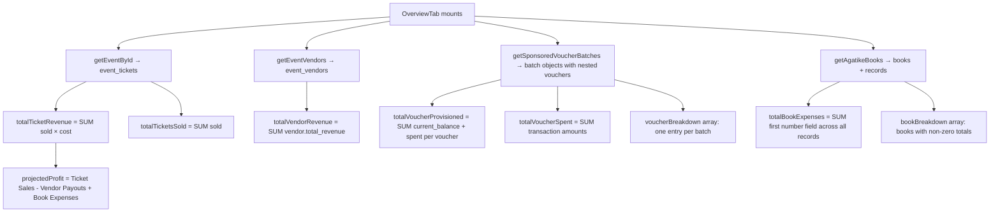
```mermaid
flowchart TD
    OT[OverviewTab mounts] --> Q1[getEventById → event_tickets]
    OT --> Q2[getEventVendors → event_vendors]
    OT --> Q3[getSponsoredVoucherBatches → batch objects with nested vouchers]
    OT --> Q4[getAgatikeBooks → books + records]

    Q1 --> TR[totalTicketRevenue = SUM sold × cost]
    Q1 --> TS[totalTicketsSold = SUM sold]
    Q2 --> VR[totalVendorRevenue = SUM vendor.total_revenue]
    Q3 --> VP[totalVoucherProvisioned = SUM current_balance + spent per voucher]
    Q3 --> VS[totalVoucherSpent = SUM transaction amounts]
    Q3 --> VB[voucherBreakdown array: one entry per batch]
    Q4 --> BE[totalBookExpenses = SUM first number field across all records]
    Q4 --> BB[bookBreakdown array: books with non-zero totals]

    TR --> PP[projectedProfit = Ticket Sales - Vendor Payouts + Book Expenses]
```

#### KPI Cards

| Card | Formula |
|---|---|
| Ticket Sales | `SUM(sold × cost)` across all ticket types |
| Vouchers Provisioned | `SUM(current_balance + spent)` per voucher |
| Vendor Payouts | `SUM(vendor.total_revenue)` |
| Book Expenses | `SUM(first number field)` in each Agatike Book |
| Est. Net Profit | `Ticket Sales − (Vendor Payouts + Book Expenses)` |

#### Voucher Portfolio Table

Shows the first **6** voucher campaigns. If there are more than 6, a "View All N Campaigns" button appears and opens a full-screen scrollable Dialog with the complete list.

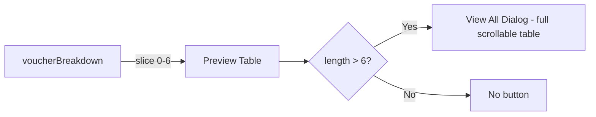
```mermaid
flowchart LR
    voucherBreakdown -->|slice 0-6| Table[Preview Table]
    Table --> Btn{length > 6?}
    Btn -->|Yes| Modal[View All Dialog - full scrollable table]
    Btn -->|No| Nothing[No button]
```

---

## 14. Attendees (`/attendees`)

**Route:** `/dashboard/$workspaceSlug/events/$eventId/attendees`  
**File:** `src/routes/dashboard.$workspaceSlug.events.$eventId.attendees.tsx`

Manages all attendee records for an event — viewing, searching, importing from RSVP forms, sending bulk emails, and exporting to CSV.

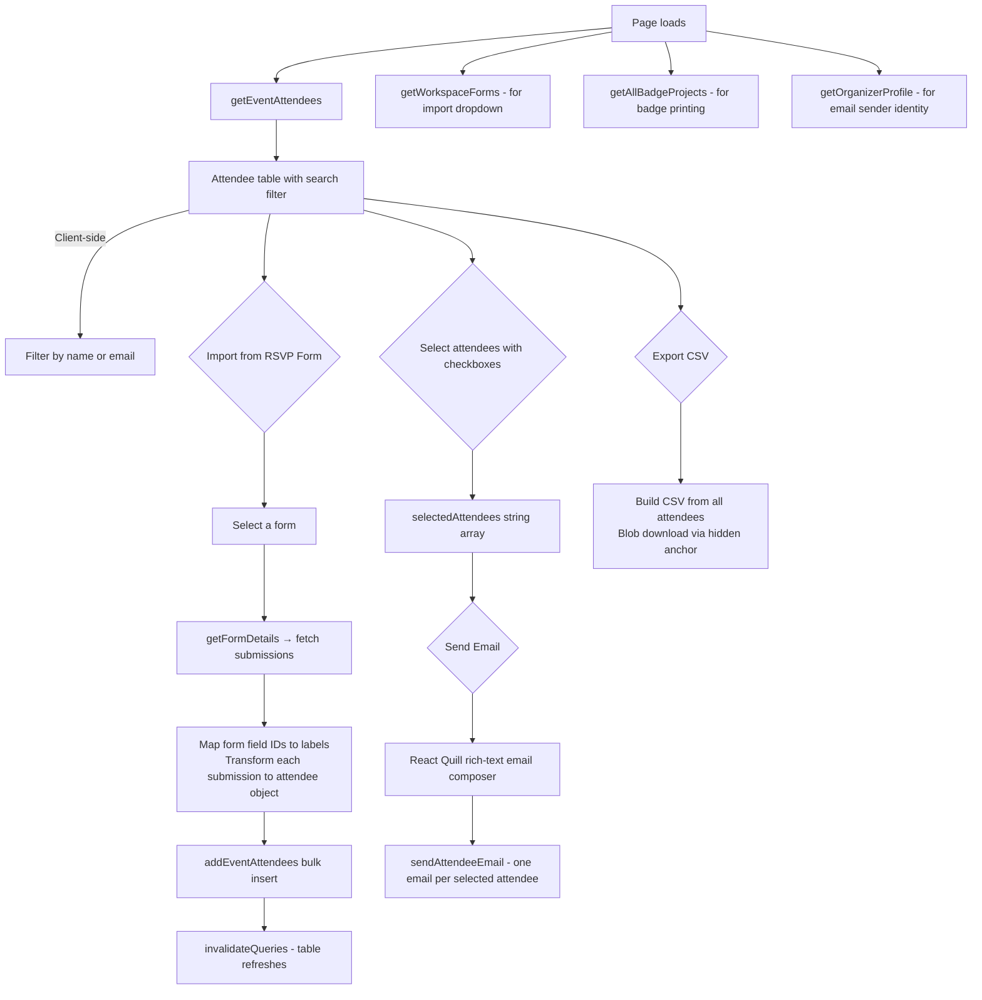
```mermaid
flowchart TD
    A[Page loads] --> B[getEventAttendees]
    A --> C[getWorkspaceForms - for import dropdown]
    A --> D[getAllBadgeProjects - for badge printing]
    A --> E[getOrganizerProfile - for email sender identity]

    B --> F[Attendee table with search filter]
    F -->|Client-side| G[Filter by name or email]

    F --> H{Import from RSVP Form}
    H --> I[Select a form]
    I --> J[getFormDetails → fetch submissions]
    J --> K[Map form field IDs to labels\nTransform each submission to attendee object]
    K --> L[addEventAttendees bulk insert]
    L --> M[invalidateQueries - table refreshes]

    F --> N{Select attendees with checkboxes}
    N --> O[selectedAttendees string array]
    O --> P{Send Email}
    P --> Q[React Quill rich-text email composer]
    Q --> R[sendAttendeeEmail - one email per selected attendee]

    F --> S{Export CSV}
    S --> T[Build CSV from all attendees\nBlob download via hidden anchor]
```

### RSVP Form Import

When an organizer imports from a custom form:
1. `getFormDetails` fetches the full form schema + all RSVP submissions
2. `form_fields` are reduced into a `{ field_id: label }` map
3. Each RSVP answer object is transformed using this map to produce a normalized attendee object
4. All attendees are bulk-inserted via `addEventAttendees`

### Email Composer

- Uses **React Quill** for a WYSIWYG rich-text editor
- Sends HTML email body to all `selectedAttendees`
- Organizer's display name and sender email are sourced from `getOrganizerProfile`

**Database table:** `event_attendees`

---

## 15. Database Tables Reference

| Table | Purpose |
|---|---|
| `events` | Core event data: title, dates, ticket types, tour stops |
| `event_vendors` | Vendors registered to an event; holds unique `VND-XXXXXX` IDs |
| `sponsored_voucher_batches` | Voucher campaigns: name, type, value, linked ticket IDs |
| `sponsored_vouchers` | Individual voucher QR codes and their current balances |
| `voucher_transactions` | Each time a vendor scans and charges a voucher |
| `agatike_books` | Custom book definitions: name + `schema_fields` JSONB |
| `agatike_book_records` | Individual data rows: `record_data` JSONB keyed by field name |
| `event_attendees` | Attendee roster per event |
| `event_staff` | Staff members with access control sections |
| `badge_projects` | Visual badge design configurations |
| `ticket_projects` | Visual ticket design configurations |
| `wallets` | Workspace financial balance |
| `wallet_transactions` | Ledger: credits (sales) and debits (payouts) |

---

## 16. API Functions Reference

### Vendors (`src/api/vendors.ts`)

| Function | Purpose |
|---|---|
| `getEventVendors` | Fetch all vendors for an event |
| `createEventVendor` | Create vendor with auto-generated `VND-XXXXXX` ID |
| `deleteEventVendor` | Delete vendor by ID |
| `getVendorTransactions` | All voucher transactions for a specific vendor |

### Vouchers (`src/api/vouchers.ts`)

| Function | Shape Returned | Used In |
|---|---|---|
| `getSponsoredVouchers` | **Flat list** — one item per voucher, batch metadata attached | Vouchers Tab table |
| `getSponsoredVoucherBatches` | **Batch objects** — one item per campaign, vouchers nested inside | Overview Tab analytics |
| `batchGenerateSponsoredVouchers` | Creates batch + optional pre-generated vouchers | Vouchers Tab create form |
| `chargeVoucher` | Records a vendor scan transaction | Scanner App |

### Agatike Books (`src/api/book.ts`)

| Function | Purpose |
|---|---|
| `getAgatikeBooks` | Fetch all books + nested records for an event |
| `createAgatikeBook` | Create a new book with `name` + `schema_fields` JSONB |
| `createAgatikeBookRecord` | Add a row (`record_data` JSONB) to a book |
| `deleteAgatikeBook` | Delete a book and all its records |
| `deleteAgatikeBookRecord` | Delete a single record from a book |

### Attendees (`src/api/attendees.ts`)

| Function | Purpose |
|---|---|
| `getEventAttendees` | Fetch all attendees for an event |
| `addEventAttendees` | Bulk insert attendees (used during RSVP import) |

### Events (`src/api/events.ts`)

| Function | Purpose |
|---|---|
| `getEventById` | Full event: metadata + `event_tickets` + `tour_stops` |

### Email (`src/api/email.ts`)

| Function | Purpose |
|---|---|
| `sendAttendeeEmail` | Send rich HTML email to one or more attendees |

---

## Updated Routing Architecture

| Route File | URL | Page |
|---|---|---|
| `index.tsx` | `/` | Landing / Home |
| `dashboard.$workspaceSlug.tsx` | `/dashboard/:slug` | Dashboard shell |
| `dashboard.$workspaceSlug.events.$eventId.planning.tsx` | `.../planning` | Budget & Settlement |
| `dashboard.$workspaceSlug.events.$eventId.attendees.tsx` | `.../attendees` | Attendees |
| `dashboard.$workspaceSlug.events.$eventId.lineup.tsx` | `.../lineup` | Event Lineup |
| `b.$qrString.tsx` | `/b/:qrString` | Public Verification |
| `__root.tsx` | — | Global App Shell |

_Last updated: June 2026 — Agatike Connect_
